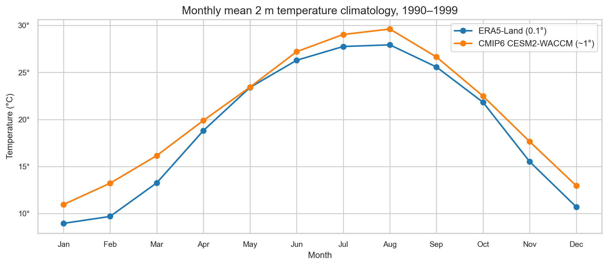
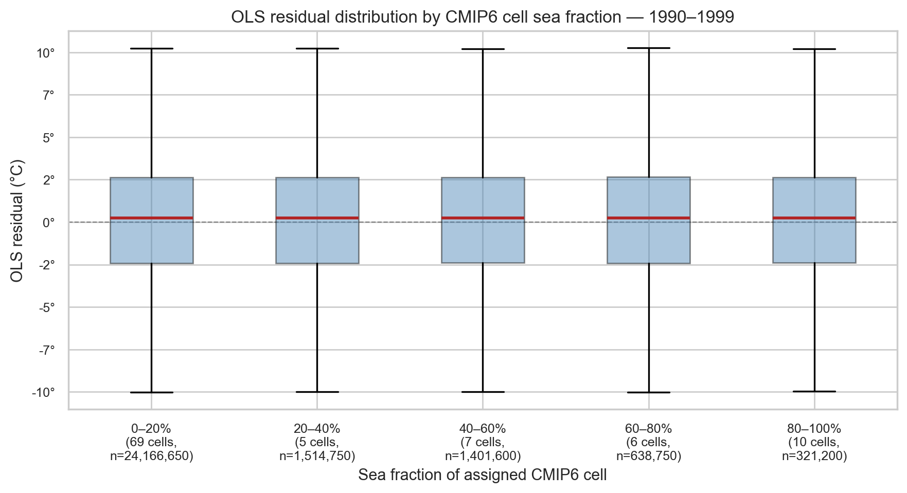
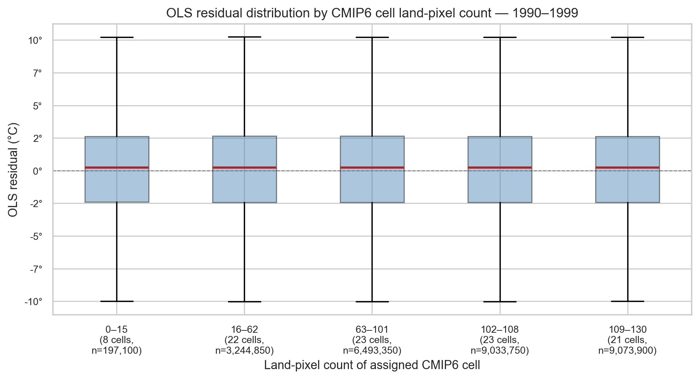
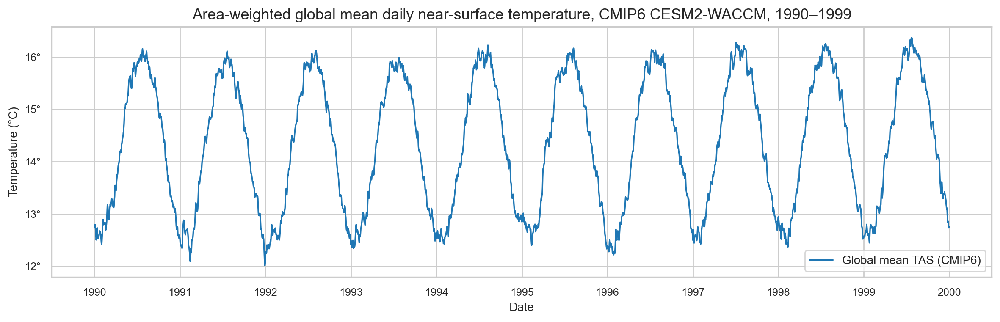

# Statistical Downscaling: Initial Findings

**Study domain:** 24–38°N, 30–38°E (Eastern Mediterranean and Middle East)
**Study period:** 1990–1999
**Notebook:** `notebooks/01_initial_data_exploration.ipynb`

---

## 1. Overview

The objective of this analysis is to develop a statistical downscaling framework that learns a mapping from coarse-resolution global climate model (GCM) output to fine-resolution near-surface temperature fields over the Eastern Mediterranean and Middle East (EMME). The predictor dataset consists of daily near-surface air temperature (TAS) from the CMIP6 CESM2-WACCM historical simulation (~1° grid), and the target dataset is the ERA5-Land reanalysis 2 m temperature (T2M) at 0.1° resolution. The study region spans 24–38°N, 30–38°E, and the analysis period covers 1990–1999. Statistical downscaling exploits the empirical relationship between the large-scale temperature field and its fine-resolution counterpart to produce high-resolution estimates from GCM output — a prerequisite for regional climate impact assessments.

---

## 2. Datasets

| Dataset | Variable | Period | Nominal resolution | Calendar |
|---|---|---|---|---|
| ERA5-Land (target) | 2 m temperature (`t2m`) | 1990–1999 | 0.1° × 0.1° (~11 km) | Gregorian |
| CMIP6 CESM2-WACCM (predictor) | Near-surface air temperature (`tas`) | 1990–1999 | ~0.94° × 1.25° (~100 km) | No-leap |

The actual spatial extents extracted from the NetCDF files are reported in `notebooks/01_initial_data_exploration.ipynb` (Section 1), as the downloaded domain includes padding beyond the nominal study boundaries.

**Descriptive statistics (after conversion to °C, land pixels only for ERA5-Land):**

| Dataset | Minimum | Mean | Maximum |
|---|---|---|---|
| ERA5-Land T2M | −21.3°C | 19.2°C | 40.6°C |
| CMIP6 CESM2-WACCM TAS | −14.7°C | 20.5°C | 41.5°C |

---

## 3. Main Statistics

| Metric | Value |
|---|---|
| Study domain | 24–38°N, 30–38°E |
| Study period | 1990–1999 (3,650 days, no-leap calendar) |
| ERA5-Land land pixels | 7,683 |
| CMIP6 cells in domain | 97 |
| Total pixel × day pairs | ~28,000,000 |
| ERA5-Land mean T2M | 19.2°C |
| CMIP6 mean TAS | 20.5°C |
| Missing data fraction | 32.7% (land–sea mask, static) |
| Pearson *r* (cell-level) | ≈ 0.9 |

---

## 4. Data Alignment & Preprocessing

### 4.1 Calendar harmonisation

ERA5-Land adheres to the proleptic Gregorian calendar, which includes 29 February in leap years (1992 and 1996 within the study period). The CMIP6 CESM2-WACCM model employs a no-leap calendar (365 days per year). To produce a common time axis, the two ERA5-Land leap days were removed, yielding a shared record of **3,650 days** spanning 1 January 1990 to 31 December 1999.

### 4.2 Unit conversion

Both datasets store temperature in Kelvin (K). Values were converted to degrees Celsius (°C) by subtracting 273.15 K.

### 4.3 Land–sea mask and missing values

ERA5-Land provides data exclusively over land grid cells; oceanic pixels are assigned NaN. Approximately **32.7%** of grid cells in the target domain contain missing values. This is a structural property of the dataset, not a data quality issue — the same pixels are missing on every day in the record, consistent with a static land–sea mask. The missing pattern aligns precisely with the Eastern Mediterranean Sea, the Red Sea, and the Persian Gulf.

The binary map below shows which pixels contribute to the analysis. Land pixels are shown in green; ocean (no-data) pixels in blue.

---

## 5. Exploratory & Descriptive Analysis

### 5.1 Temporal variation

Domain-averaged daily temperature time series for both datasets reproduce the same unimodal annual seasonal cycle across the full decade (Fig. 3a), with a summer maximum of approximately 30–32°C (July–August) and a winter minimum of approximately 8–10°C (January–February). The CMIP6 CESM2-WACCM domain mean (~20.5°C) is systematically higher than ERA5-Land (~19.2°C) by approximately 1–2°C. This warm bias is consistent across the full period and is most pronounced in late winter and early spring.

The monthly climatology (Fig. 3b) summarises the seasonal cycle and confirms that the warm bias is present in all months but is largest in February–March.

### 5.2 Spatial variation

The mean 2 m temperature climatology (1990–1999) reveals a clear north–south thermal gradient (Fig. 2). The highest mean temperatures occur over the Arabian Peninsula (~35–40°C), and the lowest over the highlands of Turkey and the Levant (~5–15°C). Coastal and topographically complex areas exhibit pronounced spatial variability in ERA5-Land that is not resolved at the CMIP6 grid scale.

### 5.3 Seasonal patterns

The four seasonal maps (Fig. 4) show ERA5-Land and CMIP6 side-by-side for each meteorological season. The north–south gradient is strongest in summer (JJA), when the Arabian heat low dominates, and weakest in winter (DJF), when the meridional temperature gradient is compressed.

### 5.4 Temperature distribution

The distribution of daily 2 m temperature values across all land pixels and all days (Fig. 5) shows that both datasets have broadly similar distributions. CMIP6 has a slightly higher median consistent with the warm bias, and narrower tails due to spatial averaging at the coarser grid.

### 5.5 Warming trends

To investigate whether a decadal warming trend is detectable from 1990–1999, quarterly temperature series were computed for a representative location: the ERA5-Land pixel and CMIP6 cell closest to 35°E, 32°N (central Levant). This location was chosen because it lies at mid-domain latitude, is entirely over land, and avoids the strong coastal and elevation gradients that dominate border cells. Domain-wide min/max trends were also checked on 1 August of each year but showed no clear monotonic signal over the 10-year baseline period — consistent with the expectation that decadal warming trends are weak relative to interannual and seasonal variability at regional scales.

---

## 6. Pairing Mechanism

### 6.1 Nearest-neighbour pixel-to-cell assignment

Each of the **7,683 ERA5-Land land pixels** was assigned to the nearest CMIP6 grid cell using nearest-neighbour matching along the latitude and longitude axes independently (an approximation to geodetic distance, adequate at these spatial scales). This procedure yielded **97 unique CMIP6 cells** covering the target domain.

The nearest-neighbour method assigns each fine-resolution pixel to exactly one coarse cell, ignoring partial spatial overlaps with adjacent cells. Alternative methods (bilinear interpolation, area-weighted remapping) are discussed in `analysis_guidelines.md`.

**Table 1.** Summary statistics of ERA5-Land (0.1°) pixel counts per CMIP6 (~1°) grid cell.

| Statistic | Value |
|---|---|
| Number of CMIP6 cells | 97 |
| Total land pixels assigned | 7,683 |
| Mean pixels per cell | ~79 |
| Median pixels per cell | (see notebook, Section 5) |
| Std. dev. | (see notebook, Section 5) |
| Minimum | (see notebook, Section 5) |
| Maximum | (see notebook, Section 5) |

### 6.2 CMIP6 grid padding

When subsetting the CMIP6 dataset to the target domain, a padding of 1.0° in latitude and 1.5° in longitude was applied beyond the nominal boundaries to ensure that grid cells whose centres lie outside the domain but whose footprints overlap it are retained. This is important for border pixels whose nearest cell centre may fall slightly outside the nominal region.

---

## 7. Coarse–Fine Temperature Relationship

### 7.1 Linear relationship

The fundamental diagnostic for downscaling feasibility is the bivariate relationship between CMIP6 TAS and ERA5-Land T2M (Fig. 7). Key findings:

1. **Strong positive linear correlation (Pearson *r* ≈ 0.9, cell-level aggregation).** Both datasets measure the same physical quantity at different spatial scales; consequently, the coarse CMIP6 cell mean is a strong predictor of the ERA5-Land pixel temperature. The correlation at the pixel level is somewhat lower, as ERA5-Land resolves sub-grid variability that CMIP6 cannot.

2. **Systematic intercept bias.** The OLS regression line does not pass through the origin, indicating a constant offset between the two datasets attributable to differences in land-surface scheme, topographic representation, and spatial averaging.

3. **Residual spread (downscaling signal).** Scatter around the regression line represents sub-grid spatial heterogeneity — the influence of local elevation, land cover, and proximity to coastlines — that CMIP6 averages away but ERA5-Land resolves. This variability constitutes the primary target signal for the downscaling model.

### 7.2 Residual diagnostics

OLS residuals (T2M minus predicted T2M) are examined as a function of CMIP6 TAS value and Euclidean distance from the assigned CMIP6 cell centre (Fig. 8).

### 7.3 Residual structure by cell characteristics *(work in progress)*

To investigate whether the OLS residuals depend on cell-level properties, pixel×day residuals (~28 million pairs) were grouped by (a) CMIP6 cell sea fraction and (b) number of ERA5-Land pixels per CMIP6 cell. The box plots in Figs. 11 and 12 show that no single cell-level factor fully explains the residual variance: all bins have comparable interquartile ranges (~4–5°C), indicating that sub-grid topographic and land-cover heterogeneity — not coastal boundary effects or cell size — is the dominant source of downscaling uncertainty.

---

## 8. Feature Engineering *(work in progress)*

As proposed by Dorita Morin, the area-weighted global mean daily TAS from the CMIP6 model (computed over all grid cells worldwide) provides a large-scale thermodynamic predictor. This global signal encodes the overall state of the climate system on each day and may improve downscaling performance beyond the local cell temperature alone by capturing the background warming state.

Fig. 9 shows the global mean TAS time series for 1990–1999. The seasonal cycle is clearly visible, and the global mean is substantially lower (~14°C) than the EMME regional mean (~20.5°C), as expected for a global average that includes polar regions.

---

## 9. Next Steps

1. **Training/validation/test split** — A temporally ordered split respecting year boundaries is required. Candidate partitions: 1990–2004 (training and validation) and 2005–2014, 2015–2025 (test periods), consistent with the project scope document (`Data 8 Mar 2026.docx`).

2. **Baseline linear model** — A per-CMIP6-cell OLS regression `T2M(pixel, day) ≈ α_cell · TAS(cell, day) + β_cell` provides an interpretable benchmark that directly exploits the near-linear coarse–fine relationship.

3. **Feature engineering** — Candidate predictors include: (a) area-weighted global mean TAS (large-scale thermodynamic predictor, proposed by Dorita Morin); (b) adjacent CMIP6 cell temperatures (for non-deep-learning models); (c) sea/land fraction per CMIP6 cell; (d) day-of-year (seasonal cycle encoding).

4. **Extension to multiple GCMs** — The pipeline will be extended to the six CMIP6 models used by Andre Klif (see `Data 8 Mar 2026.docx`, Table 2), enabling assessment of model uncertainty.

5. **Advanced models** — Random forests, gradient boosting, and neural network architectures will be evaluated against the linear baseline using spatial RMSE, bias, and correlation maps.
