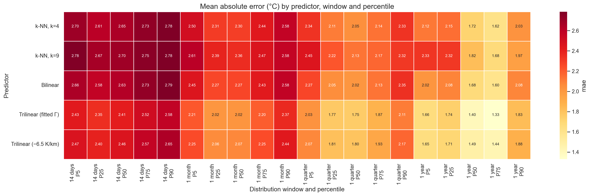
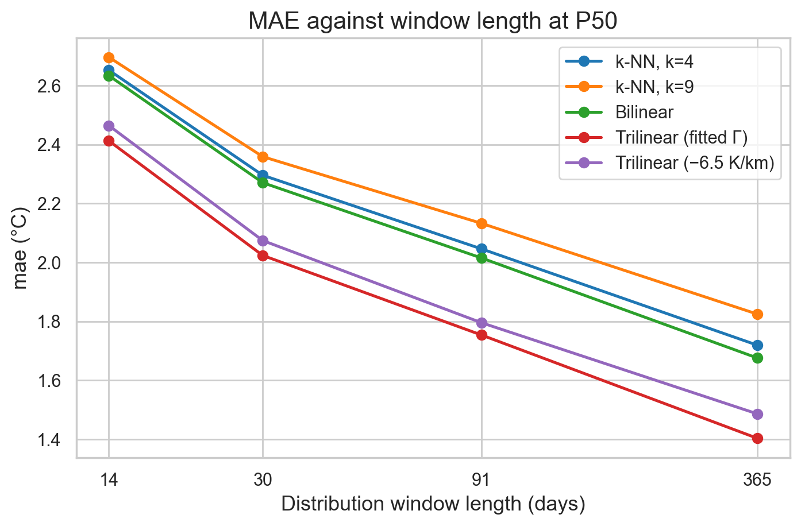

# Quantile Mapping: A New Baseline for Downscaling

**Statistical downscaling of CMIP6 temperature to ERA5-Land resolution**
Eastern Mediterranean and Middle East (24–38°N, 30–38°E) · 1990–1999 · August 2026

---

## 1. Why we changed the approach

### What we did before

Our first baseline was simple. For each day, and for each fine ERA5-Land pixel,
we took the temperature from the nearest coarse CMIP6 cell and fitted a straight
line:

```
observed temperature on day t  =  a + b × (CMIP6 temperature on day t)
```

We fitted this on 28 million pixel-day pairs. It gave a decent correlation
(r ≈ 0.9). It looked like it worked.

### Why it does not work

It does not work because **the dates do not match**.

ERA5-Land is a reanalysis. It is built from real observations, so 3 May 1994 in
ERA5-Land is the actual weather of that day. CMIP6 is a free-running climate
model. It produces its own weather. Its 3 May 1994 is *a* plausible 3 May, not
*the* 3 May. The model was never told what really happened.

So pairing the two by date is meaningless. The model has no reason to be warm on
the days that were really warm. Any day-by-day regression is fitting noise.

Ronit set this out in her note *On the baseline model* (16 August 2026), and
Efrat had raised the same point earlier. It is a known distinction in the
downscaling literature:

| Approach | Full name | How it pairs the data |
|---|---|---|
| **PP** | Perfect Prognosis | By date. Needs real day-to-day correspondence, so it can only use observations or reanalysis as the predictor — never raw GCM output. |
| **MOS** | Model Output Statistics | Not by date. Compares the *shapes of the distributions* instead. Works fine with GCM output. |

Our data forces us into MOS. The standard MOS method is **empirical quantile
mapping** (EQM, Déqué 2007).

### The new idea

Stop comparing days. Compare distributions.

Take a block of days — say all of April, May and June 1999. At one fine pixel,
that block gives 91 observed temperatures. It also gives 91 predicted
temperatures. We do not care which day is which. We only ask: **do these two
sets of numbers have the same shape?**

We measure the shape with percentiles. If the observed median for that block is
24.0 °C and the predicted median is 23.7 °C, the median is off by −0.3 °C. Do
that for every pixel, every block, and several percentiles, and you have a full
map of where and how the model's distribution is wrong.

### What this document covers

This is the **diagnostic** step. We measure the error and look for a pattern in
it. We do **not** yet fit or apply any correction. That comes next, and only
once we understand the shape of the problem.

---

## 2. The idea in one picture

```
COARSE GRID (CMIP6)                    FINE GRID (ERA5-Land)
~1 degree, about 100 km                0.1 degree, about 10 km

  +---------+---------+                 ::::::::::::::::::::
  |         |         |                 ::::::::::::::::::::
  |    A    |    B    |                 ::::::::::::::::::::
  |         |         |                 :::::::: * ::::::::     * = one pixel
  +---------+---------+       ==>       ::::::::::::::::::::
  |         |         |                 ::::::::::::::::::::
  |    C    |    D    |                 ::::::::::::::::::::
  |         |         |                 ::::::::::::::::::::
  +---------+---------+                 ::::::::::::::::::::

  One value per cell                    We need a value at every pixel
```

Step 1 is **regridding**: turn the coarse values into a value at every fine
pixel. There are several ways to do this, and choosing between them is one of
our hyper-parameters.

Step 2 is the **comparison**. At each pixel, over a block of days:

```
  Observed (ERA5-Land), 91 days           Predicted, 91 days
  of April-June 1999 at this pixel        same days, same pixel

        .:||||||:.                            .:||||:.
      .:||||||||||:.                        .:||||||||:.
    ..:||||||||||||:..                    ..:||||||||||:..
  --+-----+-----+-----+--              --+-----+-----+-----+--
   15    20    25    30 C               15    20    25    30 C

   P5  P25 P50 P75 P90                  P5  P25 P50 P75 P90
    |   |   |   |   |                    |   |   |   |   |
    +---+---+---+---+--------- compare ---+---+---+---+---+

                bias = predicted - observed
```

We do this at ~7,700 land pixels, for four block lengths, at five percentiles,
for five different regridding methods.

---

## 3. The hyper-parameters

Three choices, tested in every combination: **5 × 4 × 5 = 100 combinations**.

### 3.1 Predictor (5 options) — how we get a coarse value at a fine pixel

`knn4`, `knn9`, `bilinear`, `trilinear_fit`, `trilinear_fixed`.
Explained in full in Section 4.

### 3.2 Distribution window (4 options) — how many days go into one distribution

The blocks do not overlap and follow the calendar.

| Window | Blocks | Days per block | Example label |
|---|---|---|---|
| 14 days | 260 | 14 (last of each year: 15) | `1999-B12` |
| 1 month | 120 | 28–31 | `1999-06` |
| 1 quarter | 40 | 90–92 | `1999-Q2` |
| 1 year | 10 | 365 | `1999` |

There is a real trade-off here:

- A **short** window keeps the season sharp. Mid-January weather is not diluted
  by April weather. But 14 numbers is a small sample. The 5th percentile of 14
  numbers is basically the lowest value — a noisy estimate.
- A **long** window gives a well-measured distribution. But a whole year mixes
  summer and winter into one shape, so the seasonal detail is gone.

Section 6.3 shows which effect wins.

*A technical note:* 365 = 26 × 14 + 1, so each year gets 26 blocks and the last
one holds 15 days. We count days by their position within the year, not by
calendar day-of-year. CMIP6 uses a no-leap calendar, so we drop 29 February from
ERA5-Land in 1992 and 1996. If we used day-of-year, the blocks in those two
years would shift by one day from 1 March onward and would no longer line up
with the other eight years.

### 3.3 Percentile (5 options) — which part of the distribution

**P5, P25, P50, P75, P90.**

P50 is the median, the typical day. P5 and P90 are the cold and warm tails —
these matter most for extremes, such as heat waves. We include the tails because
a model can get the average right and still get the extremes badly wrong.

---

## 4. The five predictors, in detail

All five produce the same thing: a full field on the fine ERA5-Land grid, one
value per pixel per day. That way the observation Y and the predictor X sit at
the same place, and we can take percentiles of both in the same way.

**Notation**

| Symbol | Meaning |
|---|---|
| `p` | a fine pixel, at position (lat, lon) |
| `T_c(i, t)` | CMIP6 temperature in coarse cell `i` on day `t` |
| `X(p, t)` | the predictor value at pixel `p` on day `t` |
| `d(p, i)` | distance from pixel `p` to the centre of coarse cell `i` |

### 4.1 `knn4` and `knn9` — average of the k nearest cells

Find the `k` coarse cell centres closest to the pixel. Average their
temperatures, with equal weight.

```
                 1   k
   X(p, t)  =   ---  Σ   T_c( n_j(p), t )
                 k  j=1
```

where `n_1(p) … n_k(p)` are the `k` nearest cell centres to pixel `p`.

Distance is measured in degrees, but longitude is multiplied by cos(latitude)
first, so that a degree of longitude counts for its true ground distance. At
31°N a degree of longitude is only about 86 km, against 111 km for a degree of
latitude.

```
    k = 4                              k = 9
  +-----+-----+                  +-----+-----+-----+
  |  A  |  B  |                  |  A  |  B  |  C  |
  +-----*-----+                  +-----+-----+-----+
  |  C  |  D  |                  |  D  | *E  |  F  |
  +-----+-----+                  +-----+-----+-----+
                                 |  G  |  H  |  I  |
  average of A,B,C,D             +-----+-----+-----+

                                 average of all nine
```

The neighbour set never changes over time, so we compute it once and reuse it
for all 3,650 days.

`knn9` is the 3×3 block. We included it because Dorita and Anton found that a
3×3 regional average of TAS worked well as a predictor in their analog method
for Israeli stations. It was worth testing whether the same holds here.

**Note the weakness.** Every cell counts the same, no matter how far away it is.
A pixel sitting right on top of cell A gets just as much influence from cell D,
100 km away, as from A itself. With `k=9` the outermost cells can be 150 km off.

### 4.2 `bilinear` — distance-weighted average of the 4 surrounding cells

Standard bilinear interpolation. It uses the same 4 cells as `knn4`, but weights
them by how close they are. Let the pixel sit inside the rectangle formed by four
cell centres, and let `u` and `v` be its relative position along longitude and
latitude, each running 0 to 1:

```
   X(p, t) = (1-u)(1-v)·T_A  +  u(1-v)·T_B  +  (1-u)v·T_C  +  uv·T_D
```

```
      T_A o-------------------o T_B
          |         |         |
          |      1-v|         |
          |         |         |
          |----u----* p       |          the closer a corner is,
          |         |         |          the more weight it carries
          |        v|         |
          |         |         |
      T_C o-------------------o T_D
```

The weights always add to 1. The value changes smoothly as you move across the
domain — no jumps at cell boundaries, which `knn` does have.

In practice we use `cdo remapbil` when CDO is installed, and fall back to a
`scipy` implementation otherwise. Both give the same answer.

### 4.3 `trilinear_fit` and `trilinear_fixed` — bilinear plus a height correction

This is where the biggest improvement comes from, so it is worth going slowly.

#### The problem: what a grid value actually means

This deserves care, because the whole height correction rests on it. A natural
assumption is that a value at (lat, lon) is an estimate *at that exact point*,
so its elevation is the true elevation of that point. For these two datasets
that is not the case, and it is worth being precise about why.

**CMIP6 is explicitly a grid-cell area mean.** Our file says so in its own
metadata:

```
tas.cell_methods   = "area: time: mean"
tas.cell_measures  = "area: areacella"
source             = CAM6 (0.9x1.25 finite volume grid)
lat_bnds, lon_bnds = present   (each cell has an explicit footprint)
```

Under CF conventions, `area: mean` means the value is an average over the
horizontal extent defined by the cell bounds — not a point measurement at the
coordinate. CESM2 uses a finite-volume dynamical core, which solves for cell
averages by construction. The `lat_bnds` and `lon_bnds` arrays give each cell
its footprint: our cells span 0.942° of latitude and 1.25° of longitude.

**But the model does not average temperatures over varying terrain.** This is
the part worth stating carefully. Inside a cell the model has only *one* land
surface, at *one* height. That height comes from the model's orography, which is
built by averaging a high-resolution elevation dataset over the cell and then
smoothing it further for numerical stability. The physics runs once, on that
single smoothed surface.

So the chain is:

```
   real terrain in the cell
        |
        |  averaged + smoothed when the model was built
        v
   ONE model surface height  (roughly the cell-average elevation)
        |
        |  model physics runs here, once
        v
   ONE temperature, valid for the cell as a whole
```

The practical consequence is the same either way: **the temperature belongs to
roughly the cell-average height, not to the true height at the centre
coordinate.** But the mechanism is worth getting right — it is a smoothed
surface, not a blend of many surfaces.

**We checked this against our own data.** For the 105 coarse cells inside the
domain we compared two candidate elevations: the true ETOPO elevation at the
exact cell-centre coordinate, and the ETOPO elevation averaged over the cell
footprint. They differ by 181 m on average and by up to 1,122 m. Regressing the
decadal-mean CMIP6 temperature on latitude, longitude and elevation:

| Elevation used | R² | Implied lapse rate |
|---|---|---|
| Latitude + longitude only | 0.791 | — |
| + elevation at the centre point | 0.844 | −0.72 °C/km |
| + elevation averaged over the cell | **0.871** | **−0.97 °C/km** |

The cell average explains more. Putting both in the same regression is more
telling still: the cell average keeps a physically sensible negative coefficient
(−2.40 °C/km) while the centre-point value flips to a nonsensical *positive*
one (+1.37 °C/km). That is the signature of a variable that was only ever acting
as a noisy stand-in for the real driver.

The data agrees with the metadata. CMIP6 temperature responds to the cell's
average height.

**ERA5-Land is a different case.** It carries no `cell_methods` at all — it is
GRIB output from a land surface model on a 0.1° grid. Each grid box likewise has
a single orography height, so it is a grid-box value rather than a true point
value. But at 9 km the box is small, so the distinction matters far less than it
does at 100 km.

There is a more important point about ERA5-Land, which affects how we read our
own results. ERA5-Land is not an independent fine-scale observation. It is made
by running ECMWF's land surface model on a 9 km grid, forced by ERA5 at 31 km.
When ECMWF downscales that forcing, they **already apply a lapse-rate
correction** for the difference between the 31 km and 9 km orographies, using a
daily environmental lapse rate derived from ERA5's own temperature profiles
(Muñoz-Sabater et al. 2021).

In other words, part of the elevation signal we are measuring in ERA5-Land was
put there by a lapse-rate correction of exactly the same *kind* as ours — just
between a different pair of orographies. This does not invalidate what we did:
our `dz` is between the CMIP6 orography and the ERA5-Land orography, a much
larger gap than the one ECMWF closed. But it does mean our fitted Γ is partly
recovering a relationship that ECMWF built in, rather than one measured purely
from observations. Section 11 lists this as a caveat.

#### The picture

```
   What the coarse model has:         What is really there:

   ~~~~~~~~~~~~~~~~~~~~~~~~~~              /\
   ONE smoothed surface,                  /  \  peak 1606 m
   height ~463 m                         /    \
   ONE temperature: 7.3 C            ____/      \____
   ==========================       ================
        100 km wide cell                100 km wide cell

                          dz = 1606 - 463 = +1143 m
                          the height the model cannot see
```

Air cools as you go up, so a pixel on a mountain top is genuinely colder than a
smoothed surface 1,143 m below it. Bilinear interpolation cannot fix this,
because none of the four cells knows the mountain is there.

#### Step 1 — build `dz`, the hidden terrain

The CMIP6 file has no elevation variable, so we build the model's effective
terrain ourselves:

1. Take the ETOPO digital elevation model on the fine grid: `h_fine(p)`.
2. Average it inside each coarse cell to get the cell's mean height. This is the
   terrain the coarse model effectively resolves. All pixels count, land and sea.
3. Interpolate that coarse height field back to the fine grid, using the *same*
   bilinear operator we used for temperature. Call it `h_coarse(p)`.
4. Subtract:

```
   dz(p)  =  h_fine(p)  -  h_coarse(p)
```

`dz` is positive on peaks and ridges — ground that is higher than the coarse
model thinks. It is negative in valleys and rifts, such as the Jordan Valley.
Using the same bilinear operator in step 3 matters: it keeps `dz` consistent
with the temperature field it will correct.

#### Step 2 — apply a lapse rate

The lapse rate **Γ** (Gamma) is how fast air cools with height, in °C per metre.
The correction is simply:

```
   X(p, t)  =  X_bilinear(p, t)  +  Γ · dz(p)
```

Γ is negative, so a positive `dz` (a peak) makes the prediction colder. This is
linear in height, which is why we call it *trilinear*: bilinear in longitude and
latitude, linear in height.

> **Naming caution.** This is not the textbook trilinear interpolation of a 3-D
> gridded field. CMIP6 gives us surface temperature only — there is no vertical
> axis to interpolate along. The height term is a correction we add.

#### Step 3 — choose Γ. We tried two values.

**`trilinear_fixed`: Γ = −6.5 °C/km.** The standard environmental lapse rate
from textbooks. Not fitted to anything.

**`trilinear_fit`: Γ measured from our own data.** We take the error the bilinear
predictor makes and regress it on `dz`:

```
   observed(p, t) - X_bilinear(p, t)  =  a  +  Γ · dz(p)  +  error
```

The fitted slope is Γ. We fit one value per season, over land pixels only:

| Season | Γ (°C/km) |
|---|---|
| All days | −3.32 |
| DJF (winter) | −3.38 |
| MAM (spring) | −3.08 |
| JJA (summer) | −3.58 |
| SON (autumn) | −2.50 |

**Our fitted Γ is about half the textbook value.** Two reasons are likely. The
textbook −6.5 °C/km is for free air, high in the atmosphere. Near the ground the
air is coupled to the surface, which warms and cools it, so surface lapse rates
are usually shallower. Also, we are fitting the *bilinear error*, which mixes
the terrain signal with other biases, so the height term picks up only part of
the total.

### 4.4 A worked example — all five predictors at one pixel

Pixel at 33.4°N 35.9°E, in the Mount Hermon area. Elevation 1606 m. The coarse
grid thinks it is 463 m, so `dz = +1143 m`. Day: 1 January 1990.

The four nearest coarse cells that day:

```
   33.46N  36.25E  ->   5.71 C
   33.46N  35.00E  ->  11.49 C     <- cell over the coast, much warmer
   32.51N  36.25E  ->   5.56 C
   34.40N  36.25E  ->   6.38 C
```

The true observed value at the pixel: **4.28 °C**.

| Predictor | How it is computed | Value | Error |
|---|---|---|---|
| `knn4` | (5.71 + 11.49 + 5.56 + 6.38) / 4 | 7.28 °C | **+3.00** |
| `knn9` | mean of the 9 nearest cells | 6.86 °C | **+2.58** |
| `bilinear` | distance-weighted mean of the 4 cells | 7.32 °C | **+3.03** |
| `trilinear_fit` | 7.32 + (−0.00338 × 1143) | 3.46 °C | **−0.83** |
| `trilinear_fixed` | 7.32 + (−0.00650 × 1143) | −0.11 °C | **−4.40** |

Read this carefully, because the whole result is visible in these five rows.

The first three all land near 7 °C and are all about 3 °C too warm. They fail in
the same way, because they share the same blind spot: none of them knows about
the mountain.

`trilinear_fit` cuts the error from +3.0 to −0.8 °C.

`trilinear_fixed` overshoots. Γ = −6.5 is nearly twice our fitted value, so on a
pixel with a large `dz` it removes too much. It lands 4.4 °C too cold — worse
than doing nothing at all.

---

## 5. How we measure the error

For each combination we compute, over all (window, pixel) pairs:

```
   bias    =  mean( X - Y )              positive = predictor too warm
   MAE     =  mean( |X - Y| )            average size of the error
   RMSE    =  sqrt( mean( (X-Y)^2 ) )    punishes large errors more
   bias SD =  standard deviation of (X - Y)
   r       =  Pearson correlation of X and Y
   slope   =  OLS slope from regressing Y on X
```

**MAE is our headline number.** Bias alone can hide a bad predictor: errors of
+5 and −5 average to zero. MAE counts both.

**`bias SD` is the interesting one for what comes next.** A constant correction
can remove the mean bias. It cannot remove the spread. So `bias SD` is roughly
the error that would still be left after the simplest possible fix.

**The OLS slope** tells us the *shape* of the correction needed. A slope of 1.0
means the error is a pure offset — just add a number. A slope far from 1.0 means
the error grows or shrinks with temperature, so the correction needs a slope too.

---

## 6. Results

### 6.1 The whole grid at a glance



*Mean absolute error (°C) for all 100 combinations. Rows are predictors, columns
are window length crossed with percentile. Pale yellow is good, dark red is bad.*

Three patterns jump out, and they hold everywhere in the table:

1. The two **trilinear** rows are lighter than the other three. The height
   correction helps at every window length and every percentile.
2. Colour gets lighter **left to right**. Longer windows are better.
3. Within each window block, the **middle columns are lightest**. The median is
   easier than the tails.

### 6.2 Ranking the predictors

Averaged over all four windows and all five percentiles:

| Predictor | Bias (°C) | bias SD (°C) | **MAE (°C)** | RMSE (°C) | r | OLS slope |
|---|---|---|---|---|---|---|
| **Trilinear (fitted Γ)** | +1.09 | **2.37** | **2.03** | **2.63** | **0.942** | **1.004** |
| Trilinear (−6.5 °C/km) | **+0.75** | 2.61 | 2.08 | 2.73 | 0.928 | 0.934 |
| Bilinear | +1.42 | 2.64 | 2.28 | 3.01 | 0.925 | 1.012 |
| k-NN, k=4 | +1.43 | 2.69 | 2.31 | 3.06 | 0.922 | 1.019 |
| k-NN, k=9 | +1.52 | 2.76 | 2.37 | 3.17 | 0.917 | 1.057 |

**Two findings that were not obvious in advance.**

*More smoothing makes things worse.* `knn9` is last on every single metric,
behind `knn4`, behind `bilinear`. Averaging nine coarse cells throws away the
local gradient that the comparison needs. This does not contradict Dorita and
Anton — their task was different. They used a 3×3 mean to *select a historical
date* for a station. We are trying to reproduce a distribution at a specific
pixel, and for that, local detail matters.

*The lowest bias is not the best predictor.* `trilinear_fixed` has the smallest
mean bias (+0.75). But it has a higher MAE, a larger spread, and its OLS slope
drops to 0.934. It gets the average right by overcorrecting some places and
undercorrecting others. `trilinear_fit` has a larger mean bias but is closer on
a typical pixel — and its slope of 1.004 means what is left is almost a pure
offset, which is the easiest thing to correct later.

### 6.3 Longer windows are better — no exceptions



*MAE against window length at P50. The x-axis is days, on a log scale.*

Averaged over all five predictors:

| Window | MAE (°C) | bias SD at P50 (°C) |
|---|---|---|
| 14 days | 2.62 | 3.12 |
| 1 month | 2.34 | 2.58 |
| 1 quarter | 2.10 | 2.23 |
| 1 year | 1.81 | 2.05 |

The trade-off from Section 3.2 has a clear winner: **sampling noise matters more
than seasonal detail.** A 14-value distribution is simply too small to pin down a
percentile.

An important caution: part of the 14-day error is noise in the *target*, not a
failure of the predictor. Do not read the left of this chart as "the predictors
are bad at short time scales."

### 6.4 Where the error is: terrain

This is the most informative figure in the whole study.


*Mean bias against terrain elevation, quarterly windows, P50. Bins hold equal
numbers of pixels. Shaded band is ±1 SD within the bin.*

| Predictor | Bias at −220 m | Bias at 2,197 m | SD in top bin |
|---|---|---|---|
| k-NN, k=4 | +0.02 | **+4.66** | 2.68 |
| k-NN, k=9 | −0.22 | **+5.13** | 2.66 |
| Bilinear | +0.10 | **+4.48** | 2.59 |
| Trilinear (fitted Γ) | +0.37 | **+2.48** | 2.34 |
| Trilinear (−6.5 °C/km) | +0.67 | **+0.27** | **2.89** |

Below about 700 m all five predictors agree and are nearly unbiased. Above that,
the three without a height term climb steeply, reaching +4.5 to +5.1 °C. This is
not a small corner of the domain: **18% of our land pixels sit above 1,000 m**,
and the median land pixel is at 497 m.

The correlation between a pixel's bias and its elevation is r ≈ 0.75–0.82 for
those three predictors. Terrain is not one error among many. It is *the* error.

Now look at the last two rows again. `trilinear_fit` roughly halves the
high-elevation bias. `trilinear_fixed` flattens it almost completely (+0.27) —
but its spread in that top bin is the **worst of all five** (2.89). It gets the
average right by scattering individual pixels further from the truth. This is
the overshoot from the worked example, visible across the whole domain.

### 6.5 The same story on a map


*Mean P50 bias per pixel over all 40 quarterly windows. Red = too warm,
blue = too cold. Same colour scale in every panel.*

In panels (a)–(c) the red follows the topography exactly: the Anatolian
highlands along the top, the Levantine mountains, the Hijaz escarpment running
down the right. The blue streak near 35.5°E is the Jordan Valley, which lies
*below* sea level — there the coarse grid is too cold, exactly as the mechanism
predicts.

Panel (d), `trilinear_fit`, is visibly flatter. Panel (e), `trilinear_fixed`,
is flatter still on average but speckled — red and blue pixels sitting next to
each other in the mountains. That speckle is the extra spread in the table above.

The dark blue island at about 35°N 33°E in panel (e) is **Cyprus**, and it shows
the failure mode clearly. See Section 7.

### 6.6 One slice in close-up


*Predictor median against observed median. Each dot is one land pixel. Bilinear
predictor, April–June 1999. Colour is elevation. Dashed line is 1:1.*

The dots that fall below the 1:1 line are the pixels where the predictor is too
warm. They are systematically the high-elevation ones. The low-lying pixels sit
on the line.

---

## 7. Where the predictors break down

### Coastal cells

The height correction backfires where a coarse cell is mostly sea.

Mean P50 bias, grouped by how much of the parent coarse cell is water:

| Sea fraction of coarse cell | 0.10 | 0.30 | 0.50 | 0.69 | 0.89 |
|---|---|---|---|---|---|
| Bilinear | +1.31 | +1.43 | +1.97 | +0.97 | +0.48 |
| Trilinear (fitted Γ) | +1.11 | +0.94 | +0.79 | **−0.99** | −0.69 |
| Trilinear (−6.5 °C/km) | +0.89 | +0.38 | −0.51 | **−3.21** | −2.01 |

The mechanism is straightforward. A cell that is 70% sea has an average height
near zero, because water is at sea level. So for a land pixel inside that cell,
`dz` equals the pixel's *entire* elevation, and the correction fires at full
strength. Cyprus is the clearest case: a mountainous island surrounded by sea,
so `dz` is large and the correction pushes the prediction far too cold.

Any next step that keeps the height term must handle these cells separately.

### The tails are harder than the middle

MAE by percentile, averaged over all predictors and windows:

| P5 | P25 | P50 | P75 | P90 |
|---|---|---|---|---|
| 2.30 | 2.18 | **2.09** | 2.15 | 2.36 |

The error is smallest at the median and rises toward both ends. A correction
fitted on the median alone would under-correct the extremes — which is exactly
where a climate study usually cares most.

### The bias is strongly seasonal

Domain-mean P50 bias by calendar quarter:

| Predictor | Q1 (JFM) | Q2 (AMJ) | Q3 (JAS) | Q4 (OND) |
|---|---|---|---|---|
| Bilinear | +1.94 | +0.43 | +1.94 | +1.03 |
| Trilinear (fitted Γ) | +1.61 | +0.10 | +1.60 | +0.77 |

Winter and summer are about +1.9 °C too warm; spring is nearly unbiased. One
constant offset cannot serve all four quarters.

---

## 8. Who won

**Trilinear with a fitted Γ.** It has the lowest MAE at every window length and
every percentile — 2.03 °C against 2.28 °C for bilinear, an 11% reduction.

Three things make it the right starting point for the next phase, beyond just
winning on MAE:

1. **Its OLS slope is 1.004.** What remains is almost a pure offset. That is the
   easiest possible shape for a correction to handle.
2. **It leaves the flattest map.** Its spatial spread of bias is 1.09 °C against
   1.57 °C for bilinear. Less structure left behind.
3. **It removes the terrain signal.** The correlation of the remaining bias with
   `dz` drops from 0.72 to 0.08 — the linear part of the height effect is gone.

Best configuration overall: **trilinear with fitted Γ, on quarterly or annual
windows.**

We should be honest that the comparison slightly favours it: Γ was fitted on the
same decade we score it on, so its advantage is optimistic by an unknown amount.
A proper cross-validation — fit Γ on nine years, test on the tenth — is on the
list below.

---

## 9. What the error looks like now

The diagnostic splits the total error into three parts that behave differently.
This is the useful output of the whole exercise:

| Component | Size | Character |
|---|---|---|
| **Seasonal offset** | +0.1 to +1.9 °C | Same for all predictors. Varies by quarter, not much by place. |
| **Terrain-linked** | up to +5 °C | A linear function of `dz` removes most of it. |
| **Residual spread** | 1.0–1.5 °C | None of the five predictors removes it. A uniform correction would not touch it. |

The first two now look tractable. The third is the real remaining problem.

---

## 10. Next steps

**1. Cross-validate Γ.** Fit on nine years, test on the tenth held-out year.
This tells us how much of trilinear's advantage is real and how much is
overfitting.

**2. Let Γ vary in space.** After the correction, the bias still correlates with
elevation at r = 0.52. One Γ per season for the whole domain is clearly too
coarse. Options: fit Γ per coarse cell, or make it a smooth function of position.

**3. Handle coastal cells separately.** A land pixel in a mostly-sea cell needs
different treatment, because the cell's average height is not a fair reference
for it. This is where the height term does the most damage.

**4. Then fit the actual quantile mapping.** With the terrain signal removed, fit
the EQM transfer function that maps predicted percentiles onto observed ones. Do
it per season, since the bias is strongly seasonal.

**5. Test Ronit's quantile-regression idea.** From her note: instead of mapping
each pixel on its own, fit a quantile regression on latitude and longitude, and
use the difference between the two fitted surfaces as the correction. This would
give a smooth correction field with few parameters, which should generalise
better to a future period than a per-pixel lookup.

**6. Use the model's real orography.** CMIP6 publishes each model's own
orography as the `orog` variable in the `fx` table. We approximated it by
averaging ETOPO into coarse cells. Downloading the real `orog` for CESM2-WACCM
would make `dz` exact rather than inferred, and is a small job.

**7. Separate our Γ from ERA5-Land's built-in one.** ERA5-Land's temperature
already carries a daily lapse-rate correction applied by ECMWF between the 31 km
and 9 km orographies. Comparing our fitted Γ against ERA5 at 31 km, as well as
ERA5-Land at 9 km, would show how much of our Γ is a genuine physical signal and
how much is inherited from that construction.

**8. Widen the scope.** Currently one GCM (CESM2-WACCM, r1i1p1f1) and one decade.
The plan is six GCMs, the full Mediterranean basin, and training on 1980–2004
with 2005–2014 and 2015–2025 as test periods.

---

## 11. Caveats

- **One model, one decade.** CESM2-WACCM, r1i1p1f1, 1990–1999. Nothing here is
  yet shown to hold for other GCMs.
- **Γ is fitted and scored on the same data.** The trilinear results are
  optimistic by an unknown amount until cross-validated.
- **Short windows carry noise in the target.** A 14-day P5 or P90 is estimated
  from roughly the lowest or highest of 14 values.
- **Land pixels only.** ~7,700 pixels, 67% of the domain. ERA5-Land has no data
  over sea.
- **Our coarse orography is inferred,** by averaging ETOPO into coarse cells.
  It is not the actual orography CESM2-WACCM was run with. CMIP6 publishes that
  field as the `orog` variable in the `fx` table; fetching it for CESM2-WACCM
  would remove this approximation and is worth doing.
- **ERA5-Land already contains a lapse-rate correction.** It is produced by
  forcing a land surface model at 9 km with ERA5 at 31 km, and the forcing
  temperature is corrected for the orography difference using a daily
  environmental lapse rate derived from ERA5 (Muñoz-Sabater et al. 2021). So
  part of the height signal we fit Γ against was built in by ECMWF rather than
  measured. Our `dz` spans a much larger orography gap than the one ECMWF
  closed, so the effect is not fatal, but Γ should not be read as a purely
  observed lapse rate.
- **ERA5-Land is not an independent observation.** It is a model product
  constrained by observations, not a station network. Where it is wrong, we
  inherit the error as if it were truth.

---

## 12. How to reproduce this

```bash
# Full grid: builds the 5 predictor fields, 20 percentile tables,
# and 5 aggregate tables. Takes about 23 minutes, then caches.
python3 scripts/run_quantile_mapping.py

# The written analysis with every figure
jupyter lab notebooks/03_quantile_mapping.ipynb

# Interactive comparison of all 100 combinations
python3 -m streamlit run dashboards/qm_dashboard.py
```

**Code layout**

| File | What it does |
|---|---|
| `src/predictors.py` | The five predictor fields, and the Γ fit |
| `src/quantile_windows.py` | Window definitions and per-window percentiles |
| `src/qm_metrics.py` | Skill metrics and the aggregate tables |
| `src/qm_visualization.py` | All figures |
| `scripts/run_quantile_mapping.py` | Runs the whole grid |
| `dashboards/qm_dashboard.py` | Interactive dashboard |
| `notebooks/03_quantile_mapping.ipynb` | The written analysis |

---

## References

- **Déqué, M. (2007).** Frequency of precipitation and temperature extremes over
  France in an anthropogenic scenario. *Global and Planetary Change*, 57, 16–26.
  — the original EQM method.
- **Bedia, J., et al. (2020).** Statistical downscaling with the `downscaleR`
  package. *Geoscientific Model Development*, 13, 1711–1735. — PP methods; finds
  local predictors informative.
- **Iturbide, M., et al. (2019).** The R-based `climate4R` framework.
  *Environmental Modelling & Software*, 111, 42–54. — MOS and bias correction.
- **Gutiérrez, J. M., et al. (2019).** An intercomparison of a large ensemble of
  statistical downscaling methods over Europe. *International Journal of
  Climatology*, 39, 3750–3785. — EQM variants, Appendix A.
- **Maraun, D., & Widmann, M. (2018).** *Statistical Downscaling and Bias
  Correction for Climate Research.* Cambridge University Press.
- **Muñoz-Sabater, J., et al. (2021).** ERA5-Land: a state-of-the-art global
  reanalysis dataset for land applications. *Earth System Science Data*, 13,
  4349–4383. https://essd.copernicus.org/articles/13/4349/2021/ — describes the
  9 km production chain and the daily environmental-lapse-rate correction
  applied to the forcing temperature.
- **Danielson, J., et al. (2020).** Environmental lapse rate for high-resolution
  land surface downscaling: an application to ERA5. *Earth and Space Science*,
  7, e2019EA000984. — the daily-ELR method used in ERA5-Land, and why it beats a
  constant lapse rate.
- **CF Conventions v1.11**, §7.3 `cell_methods`.
  https://cfconventions.org/ — `area: mean` denotes an average over the cell's
  horizontal extent, not a point value.
- **Nirel, R. (2026).** *On the baseline model*, internal note, 16 August 2026.
