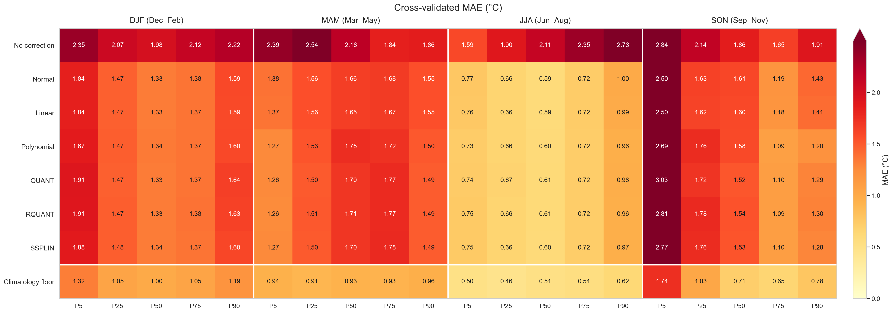
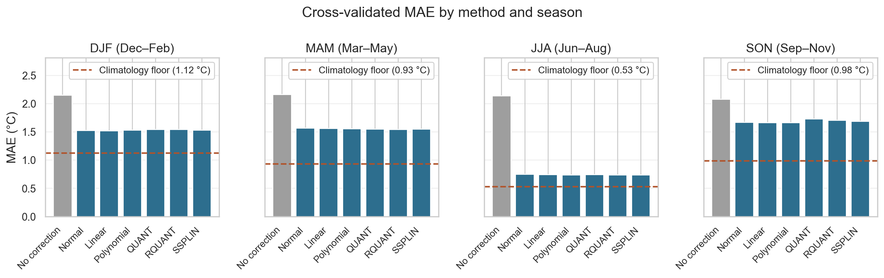
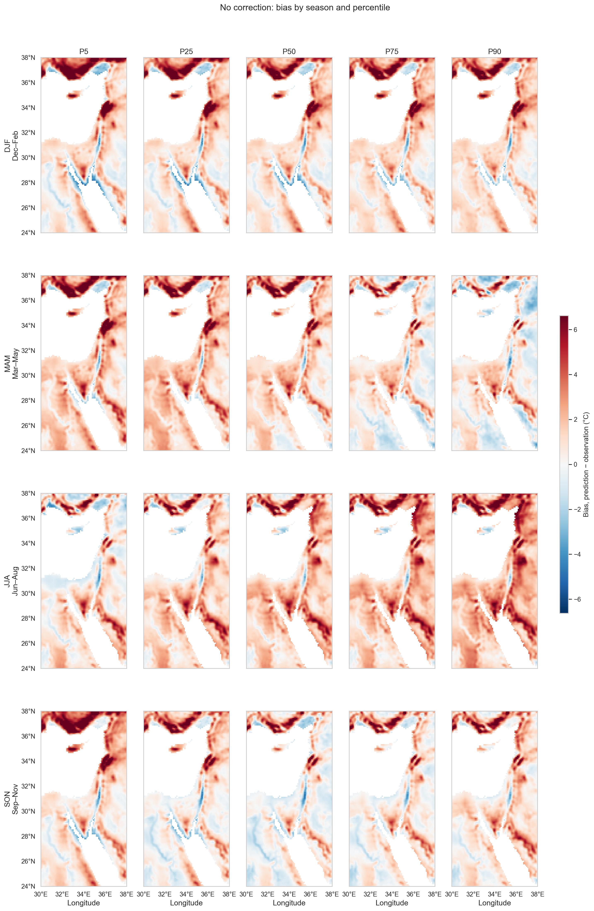
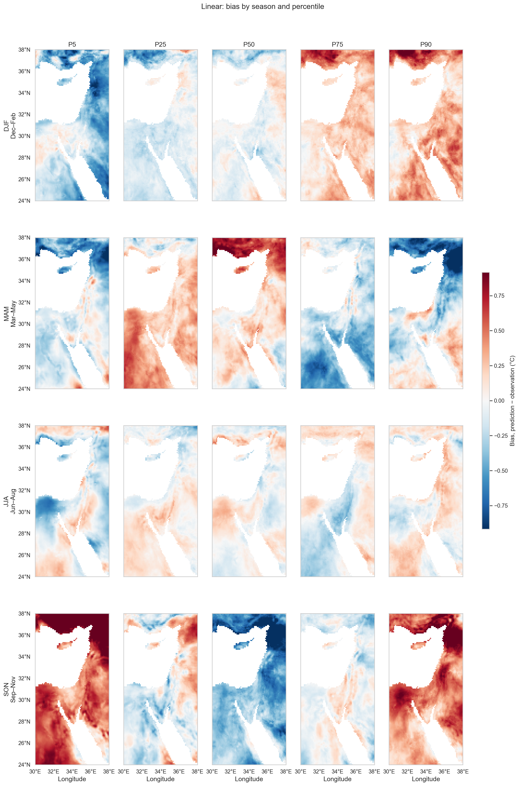
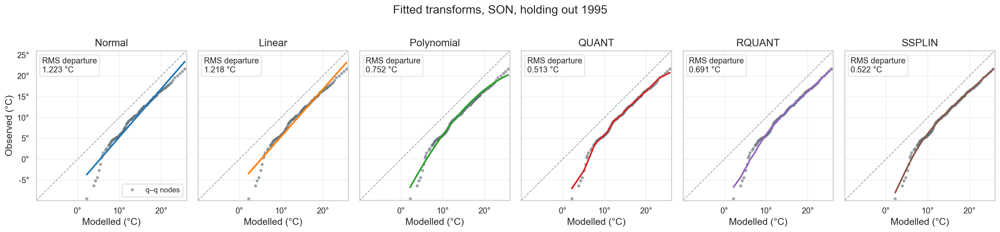
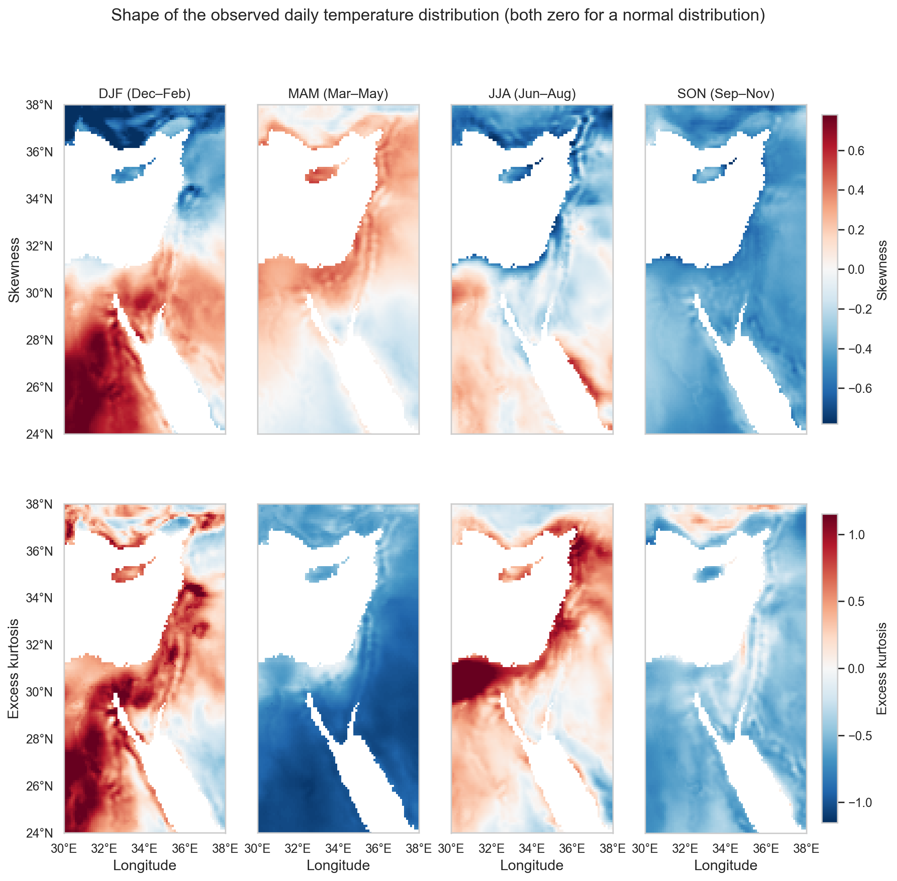

# Quantile Mapping: A Fitted, Cross-Validated Baseline

**CMIP6 temperature downscaled to ERA5-Land resolution** · Eastern Mediterranean and Middle East (24–38°N, 30–38°E) · 1990–1999

---

## Introduction

CMIP6 is a free-running model, so its 3 May 1994 is *a* plausible 3 May, not *the* 3 May. A regression that pairs each CMIP6 day with the same observed day therefore has no valid pairing to fit (Nirel 2026). The alternative is to compare distributions rather than days, which is the Model Output Statistics route and specifically quantile mapping (Déqué 2007).

Earlier work measured how far five coarse-to-fine constructions sat from the observations across four window lengths, but fitted no correction, so nothing could be scored out of sample. This document reports the fitted baseline: one modelled variable, one distribution window, six transforms, every number from a held-out year.

The question is how much of the modelled variable's error a quantile-mapping transform removes, and whether the choice of transform matters.

---

## Methods

### Modelled variable

The modelled variable is CMIP6 daily near-surface air temperature (`tas`) from CESM2-WACCM, historical experiment, member r1i1p1f1, regridded onto the ERA5-Land grid by **bilinear interpolation**.

| | Grid | Spacing | Cells in the study box |
|---|---|---|---|
| CMIP6 (source) | CESM2-WACCM finite-volume | 0.942° lat × 1.250° lon | 153 |
| ERA5-Land (target) | regular lat–lon | 0.100° × 0.100° | 11,421 |

Each fine pixel takes a weighted average of the four surrounding coarse cell values, with weights linear in latitude and longitude distance. About 118 fine pixels fall inside one coarse cell. The operation is performed once with CDO `remapbil` and cached; `scipy.interpolate.RegularGridInterpolator` is the fallback where CDO is unavailable.


### Distribution window

The distribution is estimated over a meteorological season, DJF / MAM / JJA / SON, grouped by season-year with December counted into the following year's winter. Each season-year at each pixel yields 90 to 92 daily values.

Pooled over a full year the daily distribution at a fixed pixel is bimodal, because the annual cycle dominates it, so no parametric form applies. Sub-annual stratification is standard practice: Lange (2019) adjusts per grid cell per calendar month, and Lehner et al. (2023) adjust "on a monthly basis". Reiter et al. (2018) tested the timescale directly across four methods and found that "calibrating QM with subsamples instead of the calibration data as a whole resulted in a clear benefit", with the out-of-sample optimum between semi-annual and monthly and dependent on the method.

Season rather than month is a sample-size choice. A calendar month gives about 300 training days against a season's 820, and Lehner et al. note that 30 years is the typical calibration length "since the statistical distribution of data of a shorter time period can be very noisy". Reiter et al. also found that at monthly resolution the more flexible methods corrected independent-data extremes "to unrealistically high values".

### Percentiles

Each seasonal distribution is summarised at five percentiles: **P5, P25, P50, P75 and P90**. These are the target quantities; there is one prediction and one error per percentile.

P50 is the seasonal median. P25 and P75 bound the interquartile range. P5 and P90 describe the tails without reaching the extremes: in a 92-day season P5 falls near the fifth coldest day and P90 near the ninth warmest, so both rest on several observations rather than one. True extremes, which would need a generalised extreme value treatment, are out of scope.

Percentiles are estimated with `numpy.percentile` default linear interpolation between order statistics, the same estimator on the predicted and observed side.

### Models

A transform `h` maps a modelled value to a corrected value so the corrected distribution matches the observed one. The general form is the probability integral transform, `ŷ = F_obs⁻¹(F_mod(x))`, with both distribution functions estimated from the calibration sample.

Each transform is fitted on the empirical quantile–quantile curve of the training days. The distribution-derived and parametric transforms use every training day; the three non-parametric transforms use a 99-node percentile table.[^nodes]

**Normal** — distribution derived. Both sides are assumed normal, which gives `h` in closed form as `μ_y + (σ_y/σ_x)(x − μ_x)`, with the moments estimated from the training days.

**Linear** — parametric. `h(x) = a + bx`, fitted by least squares on the sorted training pairs. Two parameters, no hyper-parameter.

**Polynomial** — parametric. A polynomial of degree *d*, with *d* ∈ {2, 3, 4, 5}. The abscissa is centred and scaled before the design matrix is built, since raw °C gives a Vandermonde condition number near 10⁹.

**QUANT** — non-parametric. The q–q relation is stored as a table of empirical percentiles and read by linear interpolation, with the table anchored at the training extremes. This is classical empirical quantile mapping (Boé et al. 2007). Node count ∈ {11, 19, 49, 99}; a table of *n* nodes places its outermost nodes at probabilities `0.5/n` and `1 − 0.5/n`, so *n* ≥ 10 is required for the table to resolve P5.

**RQUANT** — non-parametric. The same 99-node table as QUANT, with each node value smoothed against its neighbours by local linear regression applied to the residual from the linear fit. The smoothing window spans between 3 and 65 of the 99 nodes; at the widest setting the smoother is close to global. From the authors' `qmap` R package rather than the 2012 paper.

**SSPLIN** — non-parametric. A cubic smoothing spline through the q–q relation, minimising `Σ(y − f(x))² + λ∫f″²`. λ ∈ {0.01, …, 100}.

**No correction** — `ŷ = x`, the uncorrected bilinear field, carried through the same evaluation.

#### Unit of fitting

One transform is fitted per **(land pixel, season)** on the pooled daily values of the training years, 720 to 828 days. All five percentiles are read off that single transform, so percentile is an evaluation dimension and not a model dimension. A single increasing `h` keeps the corrected percentiles in order, and a per-percentile model would have only ten training points.

The correction is applied to the daily modelled values of the held-out season, and percentiles are taken of the corrected set. Applying `h` to the percentile directly gives the same answer only when `h` is affine or when quantiles are raw order statistics; under the interpolating quantile estimator used here the two routes differ by up to 0.39 °C for QUANT.

Values outside the training range receive the constant correction of Boé et al. (2007): the offset found at the nearest fitted end is carried outward. This is applied to every method.

#### Cross-validation

Leave-one-season-year-out. For each season one season-year is held out, the transform is fitted on the remaining years, and the corrected percentiles of the held-out year are compared with the observed ones.

Grouping by season-year means holding out `1991-DJF` also removes December 1990, so no fold crosses the calendar-year boundary.

A complete DJF requires a December from the preceding calendar year, so January–February 1990 and December 1999 are dropped.

| Season | Months | Folds | Days per season | Training days per fold |
|---|---|---|---|---|
| DJF | Dec–Feb | 9 | 90 | 720 |
| MAM | Mar–May | 10 | 92 | 828 |
| JJA | Jun–Aug | 10 | 92 | 828 |
| SON | Sep–Nov | 10 | 91 | 819 |

**Table 1.** Cross-validation folds per season.

Hyper-parameters are selected by an inner leave-one-season-year-out pass over a 400-pixel sample, giving one value per (method, season).

### Evaluation metrics

Four quantities are reported, all computed on held-out folds only.

| | Definition | Reads as |
|---|---|---|
| **Bias** | mean signed error, prediction − observation | positive = too warm; near zero = no systematic offset |
| **MAE** | mean absolute error | typical size of the error, in °C |
| **RMSE** | root mean squared error | as MAE but weighted towards large errors |
| **Climatology floor** | error a climatology-only prediction achieves | the part of the error no correction can remove |

The floor exists because CMIP6 is free-running: its year *k* is not the observed year *k*, so the best any correction can do is predict the **climatological** percentile. What remains is the year-to-year spread of the observation itself. Two versions are needed, because the median minimises absolute error and the mean minimises squared error:

```
MAE floor  = mean over years of | y_k − median_j(y_j) |
RMSE floor = standard deviation over years of y_k
```

For a roughly normal sample the first is about 0.8 of the second, so an MAE must be compared against the MAE floor and an RMSE against the RMSE floor.

#### How the numbers are built

One error compares one predicted percentile against one observed percentile, for one pixel in one held-out season-year:

```
ŷ = the q-th percentile of the CORRECTED daily values of season s, year k, pixel p
y = the q-th percentile of the OBSERVED daily values, same season, year and pixel
e = ŷ − y                                                              in °C
```

Both percentiles come from the 90 to 92 days of that single season-year at that single pixel.

Those errors are then aggregated in two steps:

1. **Over folds**, giving one value per (method, pixel, season, percentile). Averaging \|e\| over the season's 9 or 10 held-out years gives that pixel's MAE; averaging *e* gives its bias. These per-pixel values are what the maps in Figs. 3 and 4 show.
2. **Over pixels**, giving one value per (method, season, percentile) — the cells of Tables 2 and 4. Every (pixel, fold) pair is pooled, so each cell averages 76,830 errors, or 69,147 for DJF.

When a single MAE is reported for a method (Table 3), it is the mean of the 20 (season, percentile) cells, each of which is already an average over pixels and folds. That last mean is unweighted, so DJF's nine folds count equally with the other seasons' ten; weighting by fold count instead gives 1.368 rather than 1.372 °C for the linear fit, a difference smaller than the spread between methods.


---

## Results

### Error by percentile



**Fig. 1.** *Cross-validated mean MAE for every method, season and percentile.* Rows are methods, columns the five percentiles within each season. Each cell is the mean absolute error averaged over every land pixel and every held-out fold for that (method, season, percentile): 76,830 errors per cell, or 69,147 for DJF, where one error compares a predicted percentile against the observed percentile of one pixel in one season-year. Cell labels are in °C. The bottom row is the climatology floor, the mean MAE a climatology-only prediction would achieve, averaged the same way. Data: 7,683 land pixels, 39 season-folds, ERA5-Land and CMIP6 1990–1999.

| Method | P5 | P25 | P50 | P75 | P90 |
|---|---|---|---|---|---|
| No correction | 2.292 | 2.162 | 2.034 | 1.988 | 2.181 |
| QUANT | 1.735 | 1.338 | **1.290** | 1.238 | 1.350 |
| RQUANT | 1.682 | 1.356 | 1.297 | 1.239 | 1.344 |
| Normal | 1.622 | 1.330 | 1.297 | 1.241 | 1.392 |
| SSPLIN | 1.666 | 1.349 | 1.291 | 1.241 | 1.334 |
| Linear | **1.617** | **1.326** | 1.294 | 1.238 | 1.384 |
| Polynomial | 1.639 | 1.356 | 1.319 | **1.226** | **1.317** |
| *Climatology floor* | *1.126* | *0.863* | *0.786* | *0.791* | *0.885* |

**Table 2.** Mean MAE in °C by percentile, each value averaged over every land pixel, every held-out fold and the four seasons. Bold marks the best method at each percentile.

Every method improves on the uncorrected modelled variable at every percentile, by 0.56 to 0.86 °C. Within the six methods the differences are an order of magnitude smaller.

The lowest MAE is held by a different method at each percentile: Linear at P5 and P25, QUANT at P50, Polynomial at P75 and P90. The margin over the runner-up is 0.005 °C at P5, 0.004 at P25, 0.001 at P50, 0.012 at P75 and 0.018 at P90. Across the six methods the full range is 0.118 °C at P5, 0.030 at P25, 0.029 at P50, 0.015 at P75 and 0.075 at P90.

Error is highest at P5 for every method, 1.617 to 1.735 °C, and lowest at P75, 1.226 to 1.241 °C. The climatology floor follows the same shape: 1.126 °C at P5 against 0.791 °C at P75.

Expressed as a multiple of the floor, the linear fit sits at 1.44 at P5, 1.54 at P25, 1.65 at P50, 1.56 at P75 and 1.56 at P90. P5 carries the largest error in °C and the smallest ratio to its floor.

At P5 and P90 the ranking does not follow the three families: the linear fit has the lowest MAE at P5, and the two empirical lookups, QUANT and RQUANT, have the highest.

### Overall skill



**Fig. 2.** *Cross-validated mean MAE by method and season.* One panel per season; each bar is the MAE averaged over every land pixel, every held-out fold and the five percentiles. The uncorrected modelled variable is grey. The dashed line marks the climatology floor. Data: as Fig. 1.

Averaging the 20 (season, percentile) cells without weighting gives one number per method:

| Method | MAE (°C) | RMSE (°C) | Bias (°C) | *r* | Excess over floor | Removable error removed |
|---|---|---|---|---|---|---|
| Polynomial | 1.371 | 1.686 | +0.028 | 0.928 | 0.481 | 61.2 % |
| Linear | 1.372 | 1.692 | +0.020 | 0.928 | 0.482 | 61.2 % |
| Normal | 1.376 | 1.697 | +0.020 | 0.928 | 0.486 | 60.8 % |
| SSPLIN | 1.376 | 1.695 | +0.014 | 0.927 | 0.486 | 60.8 % |
| RQUANT | 1.384 | 1.707 | −0.011 | 0.926 | 0.493 | 60.3 % |
| QUANT | 1.390 | 1.717 | +0.010 | 0.925 | 0.500 | 59.7 % |
| No correction | 2.132 | 2.788 | +1.395 | 0.846 | 1.241 | — |

**Table 3.** Cross-validated skill, averaged over four seasons and five percentiles. "Excess over floor" is MAE minus the climatology floor of 0.890 °C. The last column is that excess as a share of the uncorrected modelled variable's removable error.

The uncorrected modelled variable is 1.395 °C too warm. Every transform removes essentially all of that systematic component, leaving residual biases of −0.011 to +0.028 °C. Spatial correlation rises from 0.846 to 0.925–0.928.

MAE falls from 2.132 to 1.371 °C, a 36 % reduction in total error and 61 % of the error that was removable at all. The six transforms span 1.371 to 1.390 °C, a range of 0.019 °C, against a 0.761 °C gap between the best of them and no correction.

### Seasonal variation

| Method | DJF | MAM | JJA | SON |
|---|---|---|---|---|
| No correction | 2.148 | 2.164 | 2.136 | 2.078 |
| QUANT | 1.545 | 1.546 | 0.741 | 1.730 |
| RQUANT | 1.545 | 1.544 | 0.739 | 1.707 |
| Normal | 1.523 | 1.565 | 0.748 | 1.670 |
| SSPLIN | 1.532 | 1.548 | 0.737 | 1.689 |
| Linear | **1.519** | 1.563 | 0.745 | **1.661** |
| Polynomial | 1.532 | 1.554 | **0.735** | 1.664 |
| *Climatology floor* | *1.121* | *0.932* | *0.527* | *0.980* |

**Table 4.** Mean MAE in °C by season, each value averaged over every land pixel, every held-out fold and the five percentiles.

The uncorrected error is nearly flat across seasons, 2.078 to 2.164 °C. After correction JJA falls to 0.735–0.748 °C while the other seasons sit at 1.519 to 1.730 °C. The floors are 0.527 °C in JJA against 1.121 °C in DJF. Relative to their own floors the seasons are similar: the linear fit is at 1.36 times the floor in DJF and 1.41 in JJA.

### Autumn cold extremes

| Method | MAE (°C) | Bias (°C) |
|---|---|---|
| Linear | 2.498 | +0.659 |
| Normal | 2.500 | +0.596 |
| Polynomial | 2.687 | +0.085 |
| SSPLIN | 2.775 | +0.036 |
| RQUANT | 2.815 | −0.156 |
| No correction | 2.837 | +1.663 |
| QUANT | 3.029 | −0.115 |

**Table 5.** MAE and bias at SON P5. The climatology floor here is 1.740 °C.

SON P5 is the hardest cell in the analysis. The floor is 1.740 °C, nearly twice the domain mean of 0.890 °C, and the uncorrected MAE is 2.837 °C. The best method reaches 2.498 °C, so 31 % of the removable error comes out against 61 % overall.

QUANT is worse than no correction here, and RQUANT and SSPLIN barely improve on it. The three methods that estimate the shape of the tail do worst; the two-parameter linear fit does best.

MAE and bias disagree in this column. Linear has the lowest MAE with a +0.659 °C bias, while SSPLIN and QUANT have near-zero bias and higher MAE. Neither is dominant.

### Spatial distribution of error



**Fig. 3.** *Bias of the uncorrected bilinear modelled variable, by season and percentile.* Rows are seasons, columns percentiles. Colour is prediction minus observation in °C, on a scale centred on zero and shared across panels. Data: as Fig. 1.



**Fig. 4.** *Bias after correction by the linear fit.* Panel layout, colour scale and sign convention as Fig. 3. Data: as Fig. 1.

The uncorrected bias is spatially coherent and largest over high ground: the Turkish highlands on the northern edge, the Levantine ridge, and the mountains flanking the Red Sea. These are the areas where the coarse grid undersamples cold terrain. After correction the residual is smaller and spatially patchier, and does not reorganise into a new systematic pattern.

### Fitted transforms



**Fig. 5.** *The six fitted transforms at one pixel, SON, holding out 1995.* One panel per method. Grey circles are the 99 training q–q nodes, pairing sorted modelled values against sorted observed values; the dashed line is 1:1 and the coloured line is that method's fitted `h`. Each panel carries its own modelled-value axis, and is annotated with the root-mean-square departure of `h` from the nodes. The pixel shown, 38.0°N 35.0°E, is the one whose autumn q–q relation departs most from a straight line, so the methods are distinguishable; at a typical pixel the departure is 0.45 °C rather than 1.22 °C and all six curves lie almost on top of one another. Data: bilinear CMIP6 modelled variable against ERA5-Land, SON 1990–1999 excluding 1995.

The q–q relation at this pixel has a pronounced S-bend. Normal and Linear, both straight lines, cut across it and leave an RMS departure of 1.22 °C. The four flexible transforms follow it and leave 0.51 to 0.75 °C, so they fit the training curve about twice as closely.

That closer fit does not carry to the held-out years: the same flexible methods do not have lower MAE in Tables 2 to 4. The extra structure they capture is partly real curvature and partly sampling noise in the nine training years, and only the first generalises. At a typical pixel the departure from a straight line is 0.45 °C rather than 1.22 °C, leaving less real curvature to capture and the same amount of noise.

### Selected hyper-parameters

| Method | DJF | MAM | JJA | SON |
|---|---|---|---|---|
| Polynomial | degree 2 | degree 5 | degree 5 | degree 2 |
| QUANT | 11 nodes | 19 nodes | 99 nodes | 11 nodes |
| RQUANT | window 65 | window 15 | window 25 | window 65 |
| SSPLIN | λ = 100 | λ = 0.1 | λ = 10 | λ = 100 |

**Table 6.** Hyper-parameter selected per method and season. Grids were polynomial degree 2–5, QUANT 11–99 nodes, RQUANT smoothing window 3–65 of the 99 nodes, SSPLIN λ 0.01–100.

Most of these selections carry little information. Across the 16 method × season combinations the inner-CV score spans **less than 0.01 °C in seven of them**, and the score is non-monotone in the hyper-parameter in eight — meaning a larger value does not move the score consistently in either direction, which is what a selection driven by noise looks like.

| Method | Season | Chosen | Spread across the grid | Score monotone in the parameter? |
|---|---|---|---|---|
| SSPLIN | SON | λ = 100 | 0.063 | yes |
| Polynomial | SON | degree 2 | 0.059 | yes |
| RQUANT | SON | window 65 | 0.045 | yes |
| QUANT | SON | 11 nodes | 0.025 | yes |
| Polynomial | MAM | degree 5 | 0.023 | yes |
| QUANT | JJA | 99 nodes | 0.019 | yes |
| SSPLIN | DJF | λ = 100 | 0.018 | yes |
| Polynomial | DJF | degree 2 | 0.013 | yes |
| Polynomial | JJA | degree 5 | 0.009 | no |
| QUANT | MAM | 19 nodes | 0.007 | no |
| QUANT | DJF | 11 nodes | 0.005 | no |
| RQUANT | MAM | window 15 | 0.004 | no |
| RQUANT | DJF | window 65 | 0.004 | no |
| SSPLIN | JJA | λ = 10 | 0.003 | no |
| RQUANT | JJA | window 25 | 0.003 | no |

**Table 7.** Inner-CV spread and shape behind each selection, ordered by spread. "Spread" is the range of inner-CV MAE across the grid, in °C. A non-monotone score indicates the selection is not driven by the parameter.

Two patterns survive that filter.

**SON prefers maximum smoothing, consistently.** All four tunable methods select the smoothest end of their grid in SON, all four are monotone, and the spreads are the largest in the table (0.025 to 0.063 °C). Autumn has the most variable tails, and every method independently finds that following them generalises worse than smoothing over them.

**JJA prefers less smoothing in QUANT.** Its inner-CV score falls monotonically from 11 to 99 nodes, so the summer distribution supports a finer table. Summer is the season with the smallest year-to-year spread.

DJF is mixed. SSPLIN and Polynomial show a real preference for smoothing, while QUANT and RQUANT show none: QUANT's four candidates span 0.005 °C in an order that is not monotone (11, 49, 19, 99), so its selection of 11 nodes is arbitrary rather than informative. MAM is mostly noise as well.

The practical consequence is that the hyper-parameter grids can be narrowed or dropped for future work. Only SON, and QUANT in JJA, show a preference worth acting on.

### Fit diagnostics

| Method | Non-monotone `h` | Extrapolated |
|---|---|---|
| Normal | 0.00 % | 19.54 % |
| Linear | 0.00 % | 19.54 % |
| QUANT | 0.00 % | 19.54 % |
| RQUANT | 0.00 % | 19.54 % |
| SSPLIN | 4.16 % | 19.54 % |
| Polynomial | 7.38 % | 19.54 % |

**Table 8.** Diagnostics over all 299,637 fits per method. "Non-monotone" is the share of fits whose transform decreased somewhere in its fitted range, requiring the corrected percentiles to be forced back into order. "Extrapolated" is the share where at least one held-out percentile fell outside the training range; it is identical across methods because the same modelled percentiles are evaluated. Normal, Linear and Polynomial were fitted on 720–828 training days and the three non-parametric methods on 99 nodes, per the split described in Methods.

Normal, Linear, QUANT and RQUANT are increasing by construction. The polynomial requires the monotonicity repair in 7.38 % of fits and SSPLIN in 4.16 %.

Normal, Linear and Polynomial were fitted on 720 to 828 training days and the three non-parametric methods on 99 nodes, following the split described in Methods.

In 19.54 % of fits at least one held-out percentile falls outside the training range, so the constant-offset extrapolation rule is applied rather than the fitted transform. The figure is identical across methods because the same modelled percentiles are evaluated in every case.

### Distribution shape



**Fig. 6.** *Skewness and excess kurtosis of the observed daily temperature, by season.* Both are zero for a normal distribution; the colour scale is centred on zero. Data: ERA5-Land daily 2 m temperature, land pixels of the EMME domain, 1990–1999.

| Season | Skewness | Excess kurtosis |
|---|---|---|
| DJF | +0.105 | +0.420 |
| MAM | +0.095 | −0.825 |
| JJA | −0.118 | +0.278 |
| SON | −0.423 | −0.438 |

**Table 9.** Domain-mean skewness and excess kurtosis of the observed daily values, by season.

Departures from normality are small in DJF, MAM and JJA, with absolute skewness below 0.12. SON is the exception at −0.423, a left-skewed distribution with a longer cold tail. This is the same season and the same tail where the corrections perform worst (Table 5).

These magnitudes are consistent with Perron and Sura (2013), who report non-Gaussian daily statistics globally with seasonally varying departures, and with Ruff and Neelin (2012), who find non-Gaussian tails common in station temperature records.

---

## Discussion

Applying a correction reduces MAE by 36 % and removes 61 % of the removable error, while the choice among the six transforms changes MAE by at most 0.019 °C. The best method varies by percentile with margins of 0.001 to 0.018 °C, within the noise of the comparison.

The two-parameter linear fit is therefore sufficient for this baseline. It matches a degree-5 polynomial, a smoothing spline and a 99-node empirical lookup, is increasing by construction, has no hyper-parameter, and is the cheapest to fit.

Two factors limit how much the transforms can differ. First, 65 % of the residual error is irreducible: the climatology floor is 0.890 °C against the best method's 1.371 °C, because the model simulates a plausible year rather than the observed one. The methods compete over 0.481 °C, not 1.371 °C. The seasonal contrast makes the same point — JJA's 0.745 °C looks far better than SON's 1.661 °C, but relative to their floors they are 1.41 and 1.70 times, so summer is more repeatable rather than easier to correct.

Second, the calibration sample is short. Where the hyper-parameter selection carries a real signal it points towards smoothing: all four tunable methods pick the smoothest end of their grid in SON, monotonically (Table 8), and the two empirical lookups finish behind the linear fit rather than ahead of it. Gudmundsson et al. (2012), whose non-parametric methods ranked first on 41 years of station precipitation, state that overfitting "may be an issue if the nonparametric transformations are calibrated using small data samples". Lehner et al. (2023) report that "non-parametric QM depends more on the calibration period than parametric QM". Reiter et al. (2018) found the more complex methods correcting independent-data extremes to unrealistic values once the calibration subsample became small. With ten years the flexible methods have little signal left to fit.

The out-of-sample design is necessary for this conclusion. Quantile mapping reproduces its training percentiles exactly, so any within-fold score would rank the most flexible method first. The polynomial's 7.38 % non-monotone rate alongside an MAE within 0.001 °C of a straight line is consistent with that.

The autumn cold tail is where the correction adds least. At SON P5 the floor is 1.740 °C, the best method removes 31 % of the removable error, and QUANT performs worse than no correction. This is also the season with the largest departure from normality, skewness −0.423, and the only cell where the methods separate materially.

### A climatology benchmark beats every method

Predicting the observed percentile of a specific held-out year without using the model at all — the mean of the other nine years' observed percentile at that pixel — gives an MAE of **1.032 °C**, against 1.371 °C for the best transform. Climatology wins in every season and at every percentile: 0.803 °C against about 1.55 at SON P50, 0.532 against about 0.66 at JJA P25.

The reason is visible in the year-to-year correlation between the modelled and the observed seasonal percentile. Averaged over land pixels it is 0.12 at P5, 0.05 at P25, 0.10 at P50, 0.14 at P75 and 0.08 at P90. The model carries almost no information about which particular year was warm or cold, which is expected of a free-running simulation: it is not initialised from observations and assimilates none, so its internal variability is its own.

| Season | Percentile | Climatology | Best transform | which | No correction |
|---|---|---|---|---|---|
| DJF | P5 | **1.552** | 1.838 | Linear | 2.353 |
| DJF | P25 | **1.242** | 1.467 | Linear | 2.067 |
| DJF | P50 | **1.204** | 1.328 | QUANT | 1.984 |
| DJF | P75 | **1.238** | 1.370 | QUANT | 2.116 |
| DJF | P90 | **1.389** | 1.586 | Linear | 2.221 |
| MAM | P5 | **1.082** | 1.257 | RQUANT | 2.389 |
| MAM | P25 | **1.018** | 1.501 | SSPLIN | 2.545 |
| MAM | P50 | **1.057** | 1.654 | Linear | 2.185 |
| MAM | P75 | **1.041** | 1.675 | Linear | 1.841 |
| MAM | P90 | **1.101** | 1.486 | RQUANT | 1.858 |
| JJA | P5 | **0.574** | 0.730 | Polynomial | 1.590 |
| JJA | P25 | **0.532** | 0.656 | SSPLIN | 1.897 |
| JJA | P50 | **0.577** | 0.589 | Linear | 2.111 |
| JJA | P75 | **0.617** | 0.716 | QUANT | 2.350 |
| JJA | P90 | **0.718** | 0.961 | RQUANT | 2.732 |
| SON | P5 | **2.064** | 2.498 | Linear | 2.837 |
| SON | P25 | **1.158** | 1.621 | Linear | 2.137 |
| SON | P50 | **0.806** | 1.519 | QUANT | 1.858 |
| SON | P75 | **0.743** | 1.086 | Polynomial | 1.645 |
| SON | P90 | **0.891** | 1.205 | Polynomial | 1.912 |
| **Mean** | | **1.030** | **1.337** | | **2.132** |

**Table 10.** Mean MAE in °C for the climatology benchmark, the best transform in each cell, and no correction. "Climatology" predicts the mean of the other nine years' observed percentile at that pixel and uses no model input. "Best transform" is the lowest MAE among the six in that cell, with the method named. Bold marks the lower of climatology and the best transform. Averaged over every land pixel and every held-out fold, as elsewhere.

Climatology has the lower MAE in **all 20 cells**. The gap is widest at SON P50, 0.806 against 1.519 °C, and at MAM P75, 1.041 against 1.675 °C. It is narrowest in summer: at JJA P50 the two are 0.577 and 0.589 °C, effectively equal. Both predictors beat no correction everywhere.

This is not a failure of the transforms. They reproduce the observed year-to-year spread almost exactly — the standard deviation of the corrected percentile across years is 1.184 °C against 1.183 °C observed, a ratio of 1.00. But a prediction with the correct variance and no correlation to the truth has an error variance of twice the observed variance, so its RMSE is `σ√2 = 1.673 °C`; the measured value is 1.692 °C. A climatological prediction instead varies hardly at all, giving `σ√(1 + 1/K) = 1.247 °C` for K = 9 training years against a measured 1.298 °C. The transforms are penalised for succeeding at the thing they are designed to do.

**This is not a sample-size effect.** The `√2` term does not depend on the record length, while the climatology term shrinks slowly towards `σ`. The predicted ratio of the two is 1.342 at K = 9, 1.386 at K = 24, and 1.414 in the limit, against 1.303 measured here. Extending the record to 25 years would therefore widen the gap slightly rather than close it. The correlation estimates are individually noisy at ten years — the standard error of a correlation from ten points is about 0.38 — but the variance decomposition does not depend on estimating them, and it accounts for the observed gap on its own.

What it does indicate is that a year-specific target is the wrong one for this method. Quantile mapping is built to make a corrected series carry the right distribution, not to say which year was which. Measured against the target used here, ignoring the model is the better strategy, and no choice of transform changes that. A distribution-level evaluation — pooling the held-out years and comparing the pooled corrected distribution against the pooled observed one — would test what the method is for. That evaluation has not been run.

### Next steps

1. **Train/test split.** Cross-validation measures sampling error, not transferability. The 1980–2004 training period with 2005–2014 and 2015–2025 test periods is required to test whether a transform holds under a changed climate.
2. **A trend-preserving variant before any projection.** Plain quantile mapping builds its transfer function from the historical period alone. Cannon et al. (2015) report relative changes in 20-year return values exceeding +1500 % under plain QM against +120 % in the raw model. The 19.54 % extrapolation rate measured here is the same mechanism inside a stationary decade. QDM in additive form is the minimal upgrade; Switanek et al. (2017) give an explicit temperature algorithm.
3. **Month rather than season**, once 25 years of training data are available.
4. **Deliberate shrinkage towards climatology.** Where the year-to-year spread is large, a correction weighted towards the climatological percentile in proportion to that spread may outperform one that tracks the model. SON P5 is where this would matter most.
5. **A distribution-level evaluation, and a climatology row in the tables.** Pool the held-out years and compare the pooled corrected distribution against the pooled observed one, which is the target quantile mapping is designed for. Report the climatology benchmark alongside the transforms, since it is the predictor any method has to beat on a year-specific target.
6. **Repeat this comparison on the full data set.** The 1980–2004 training period, the 2005–2014 and 2015–2025 test periods and the full Mediterranean basin (24–47°N, 11°W–40°E) give 25 calibration years instead of 10 and roughly six times the domain. Both limits identified here — the short calibration record and the flatness of the comparison between methods — are properties of the present sample, so the ranking should not be treated as settled until it has been re-run at that scale. Choosing a method to carry forward is a decision for after that run, not before it.

[^nodes]: The split follows the `qmap` R package (Gudmundsson 2016), which
    accompanies Gudmundsson et al. (2012) and implements the same six methods.
    Its `qstep` argument controls the reduction: the observed and modelled
    series are "aggregated to quantiles before model identification as
    `quantile(x, probs = seq(0, 1, by = qstep))`". `fitQmapDIST` and
    `fitQmapPTF`, the distribution-derived and parametric fitters, default to
    `qstep = NULL`, meaning every data point. `fitQmapQUANT`, `fitQmapRQUANT`
    and `fitQmapSSPLIN` default to `qstep = 0.01`, a 101-point table, and every
    worked example in the manual uses that value.

    The manual notes the reduction "effectively reduces the sample-size and can
    be used to speedup computations - but may render estimates less reliable".
    We measured that on 641 pixels across all four seasons, refitting each
    method at 99, 199, 399 and 720 nodes, where 720 is every training day of the
    shortest season. MAE changed by at most **0.003 °C** against errors of
    1.37 °C and a climatology floor of 0.89 °C. For RQUANT and SSPLIN the fuller
    sample was very slightly *worse* — a finer table gives a smoother more noise
    to follow — while Normal was unchanged to five decimals, since its moments
    come from the raw days regardless. The cost is asymmetric: the smoothing
    spline is about five times slower on raw days.

---

## References

- **Boé, J., Terray, L., Habets, F., Martin, E. (2007).** Statistical and dynamical downscaling of the Seine basin climate for hydro-meteorological studies. *International Journal of Climatology*, 27, 1643–1655.
- **Cannon, A. J., Sobie, S. R., Murdock, T. Q. (2015).** Bias correction of GCM precipitation by quantile mapping: how well do methods preserve changes in quantiles and extremes? *Journal of Climate*, 28, 6938–6959.
- **Déqué, M. (2007).** Frequency of precipitation and temperature extremes over France in an anthropogenic scenario. *Global and Planetary Change*, 57, 16–26.
- **Gudmundsson, L., Bremnes, J. B., Haugen, J. E., Engen-Skaugen, T. (2012).** Technical Note: Downscaling RCM precipitation to the station scale using statistical transformations — a comparison of methods. *Hydrology and Earth System Sciences*, 16, 3383–3390.
- **Gudmundsson, L. (2016).** `qmap`: Statistical Transformations for Post-Processing Climate Model Output. R package version 1.0-4. The reference implementation of the six methods compared here.
- **Lange, S. (2019).** Trend-preserving bias adjustment and statistical downscaling with ISIMIP3BASD (v1.0). *Geoscientific Model Development*, 12, 3055–3070.
- **Lehner, F., Nadeem, I., Formayer, H. (2023).** Evaluating skills and issues of quantile-based bias adjustment for climate change scenarios. *Advances in Statistical Climatology, Meteorology and Oceanography*, 9, 29–44.
- **Maraun, D. (2013).** Bias correction, quantile mapping, and downscaling: revisiting the inflation issue. *Journal of Climate*, 26, 2137–2143.
- **Muñoz-Sabater, J., et al. (2021).** ERA5-Land: a state-of-the-art global reanalysis dataset for land applications. *Earth System Science Data*, 13, 4349–4383.
- **Nirel, R. (2026).** *On the baseline model*, internal note, 16 August 2026.
- **Perron, M., Sura, P. (2013).** Climatology of non-Gaussian atmospheric statistics. *Journal of Climate*, 26, 1063–1083.
- **Reiter, P., Gutjahr, O., Schefczyk, L., Heinemann, G., Casper, M. (2018).** Does applying quantile mapping to subsamples improve the bias correction of daily precipitation? *International Journal of Climatology*, 38, 1623–1633.
- **Ruff, T. W., Neelin, J. D. (2012).** Long tails in regional surface temperature probability distributions with implications for extremes under global warming. *Geophysical Research Letters*, 39, L04704.
- **Switanek, M. B., et al. (2017).** Scaled distribution mapping: a bias correction method that preserves raw climate model projected changes. *Hydrology and Earth System Sciences*, 21, 2649–2666.

Papers are held under `articles/quantile_mapping/`, which is gitignored.
