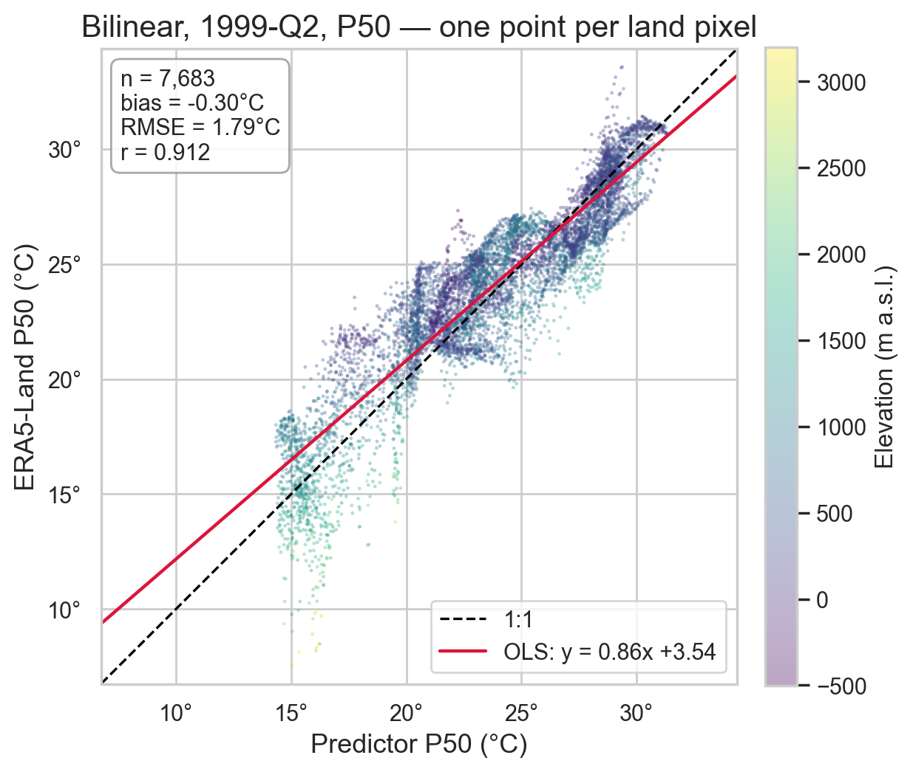
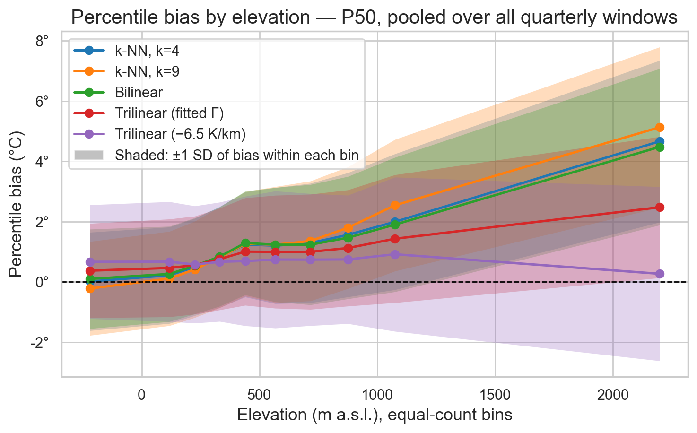
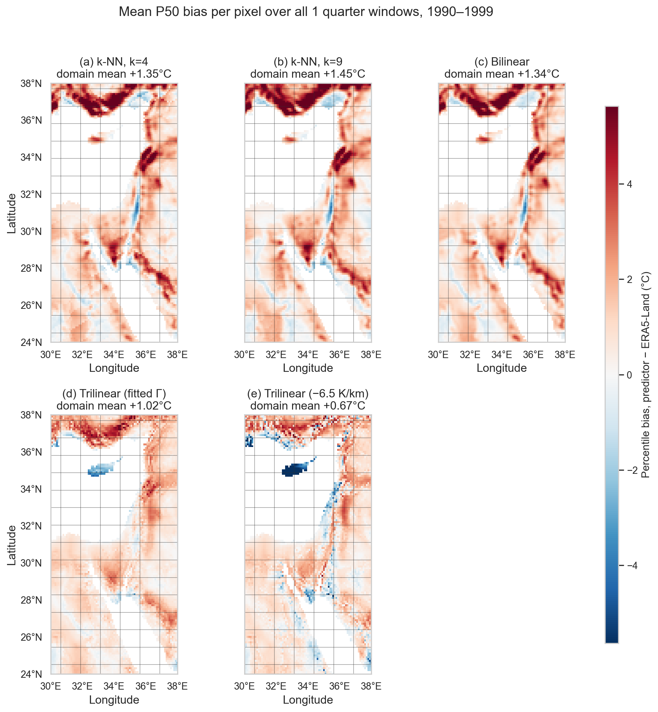

# Quantile Mapping: A Distribution-Based Baseline

**CMIP6 temperature downscaled to ERA5-Land resolution** · Eastern Mediterranean and Middle East (24–38°N, 30–38°E) · 1990–1999

Our earlier baseline paired each day in CMIP6 with the same day in ERA5-Land and fitted a regression. That pairing is not valid. CMIP6 is a free-running model, so its 3 May 1994 is *a* plausible 3 May, not *the* 3 May. Ronit set this out in her note *On the baseline model* (16 Aug 2026). The fix is to stop comparing days and compare distributions instead. That is the standard Model Output Statistics route, and specifically empirical quantile mapping (Déqué 2007). This document reports the diagnostic step. We measure the error and look for a pattern in it. We do not yet fit a correction.

---

## Methods

### 1. What a CMIP6 and an ERA5-Land grid value represent

**CMIP6 temperature.** We use `tas` from CESM2-WACCM (historical, r1i1p1f1). The variable is near-surface air temperature at about 2 m. The important detail is that it is not a point estimate at the cell centre. The file says so in its own metadata:

```
tas.cell_methods   = "area: time: mean"
tas.cell_measures  = "area: areacella"
source             = CAM6 (0.9x1.25 finite volume grid)
lat_bnds, lon_bnds = present
```

Under CF Conventions (v1.11, §7.3), `area: mean` means the value is an average over the horizontal extent set by the cell bounds, not a measurement at the coordinate. CESM2 uses a finite-volume dynamical core, which solves for cell averages by design. Our cells span 0.942° of latitude by 1.25° of longitude, roughly 100 km.

**Which elevation belongs to that temperature.** Inside a grid cell the model has one land surface at one height. That height is the model's orography, built by averaging a high-resolution elevation dataset over the cell footprint and then smoothing it for numerical stability. The physics runs once, on that single surface. So the model does not average temperatures over varying terrain. It replaces the terrain with one smoothed surface and computes one temperature above it. CMIP6 publishes this field as `orog` in the `fx` table. We did not have it for CESM2-WACCM, so we approximated it (Section 2).

We checked this against our own data rather than trusting the metadata alone. For the 105 coarse cells inside the domain we compared two candidate elevations: the true elevation at the exact cell-centre coordinate, and the elevation averaged over the cell footprint. They differ by 181 m on average and by up to 1,122 m. Regressing decadal-mean CMIP6 temperature on latitude, longitude and elevation gives:

| Elevation used | R² | Implied lapse rate |
|---|---|---|
| latitude + longitude only | 0.791 | — |
| + elevation at the centre point | 0.844 | −0.72 °C/km |
| + elevation averaged over the cell | **0.871** | **−0.97 °C/km** |

The cell average wins. Put both in one regression and the cell mean keeps a sensible −2.40 °C/km while the centre-point value flips to a nonsensical +1.37 °C/km. That is what a variable looks like when it was only ever a noisy stand-in for the real driver.

**ERA5-Land temperature.** ERA5-Land carries no `cell_methods`, since it is GRIB output on a 0.1° grid. Each grid box also has a single orography height, so it is a grid-box value rather than a true point value. At 9 km that distinction matters far less than it does at 100 km.

One point matters for how we read our own results. ERA5-Land is not an independent fine-scale observation. Muñoz-Sabater et al. (2021) describe it as high-resolution runs of the ECMWF land surface model driven by downscaled ERA5 forcing. When ECMWF downscale that forcing from 31 km to 9 km, they already correct the air temperature for the orography difference, using "a daily environmental lapse rate (ELR) field derived from ERA5". So part of the height signal we measure was put there by ECMWF, not observed. Our own height correction spans a much larger gap, so this is not fatal, but it is a real caveat.

### 2. Elevation data and the coarse orography

We used ETOPO (ice surface, 1 arc-minute), downloaded from the NOAA CoastWatch ERDDAP server for our bounding box. It is cached locally and regridded once by linear interpolation onto the 0.1° ERA5-Land grid, giving `h_fine(p)` at every pixel. The code is in `src/elevation.py`.

To get the coarse model's effective terrain we averaged that fine elevation inside each CMIP6 cell, using every pixel, land and sea. This stands in for the model's real `orog` field, which we did not have. Fetching the real `orog` would make it exact and is on the next-steps list.

### 3. Regridding the coarse field onto the fine grid

The coarse grid is about 100 km per cell and the fine grid is about 10 km. Every fine pixel needs a coarse value, and there is more than one way to produce one. That choice is our first hyper-parameter.

```
COARSE (CMIP6, ~100 km)              FINE (ERA5-Land, ~10 km)
  +---------+---------+                ::::::::::::::::::::
  |    A    |    B    |                ::::::::::::::::::::
  +---------*---------+     ==>        :::::::: * ::::::::
  |    C    |    D    |                ::::::::::::::::::::
  +---------+---------+                ::::::::::::::::::::
   one value per cell                  a value at every pixel
```

Once every pixel has a predicted value, we take a block of days and compare two distributions at that pixel: the observed one (Y) and the predicted one (X). We never ask which day is which. We only ask whether the two sets of numbers have the same shape, and we measure shape with percentiles. Bias is defined as `X − Y`, so a positive bias means the predictor is too warm.

### 4. Hyper-parameters: windows, percentiles and predictors

Three hyper-parameters, run in every combination: 5 predictors × 4 windows × 5 percentiles = 100 combinations, over about 7,700 land pixels.

**Distribution window** is how many days go into one distribution. Blocks do not overlap and follow the calendar.

| Window | Blocks | Days each | Example label |
|---|---|---|---|
| 14 days | 260 | 14 (last of year: 15) | `1999-B12` |
| 1 month | 120 | 28–31 | `1999-06` |
| 1 quarter | 40 | 90–92 | `1999-Q2` |
| 1 year | 10 | 365 | `1999` |

Short windows keep the season sharp but give a small sample, so a percentile is noisy. Long windows give a well-measured distribution but blur the seasons. The Findings show which effect wins.

**Percentiles** are P5, P25, P50, P75 and P90. The median is the typical day. The tails matter for extremes, where a model can look fine on average and still be badly wrong.

**Predictors** are five ways to get a coarse value at a fine pixel.

`knn4` and `knn9` take the k nearest coarse cell centres and average them with equal weight:

```
X(p,t) = (1/k) · Σ T_c(n_j(p), t)
```

Distance is in degrees with longitude scaled by cos(latitude), so it reflects real ground distance. `knn9` is the 3×3 block, included because Dorita and Anton found a 3×3 regional mean worked well in their analog method. The weakness is that a cell 100 km away counts as much as the one directly overhead.

`bilinear` uses the same four surrounding cells but weights them by distance, so a nearer cell counts more:

```
X(p,t) = (1−u)(1−v)·T_A + u(1−v)·T_B + (1−u)v·T_C + uv·T_D
```

Here `u` and `v` are the pixel's relative position across the cell, each running from 0 to 1. The weights sum to 1 and the field is smooth across cell boundaries.

`trilinear_fit` and `trilinear_fixed` add a height correction to the bilinear field. The coarse cell sits at one smoothed height, but the real pixel may be far above it, and air cools with height. We define the hidden terrain as

```
dz(p) = h_fine(p) − h_coarse(p)
```

where `h_coarse` is the cell-mean elevation interpolated back to the fine grid with the same bilinear operator used for temperature. The predictor is then

```
X(p,t) = X_bilinear(p,t) + Γ · dz(p)
```

Γ is the lapse rate in °C per metre and it is negative, so a peak gets colder. We tried two values. `trilinear_fixed` uses the textbook −6.5 °C/km. `trilinear_fit` measures Γ from our own data, by regressing the bilinear error on `dz`, one value per season:

| Season | Γ (°C/km) |
|---|---|
| All | −3.32 |
| DJF | −3.38 |
| MAM | −3.08 |
| JJA | −3.58 |
| SON | −2.50 |

Our fitted Γ is about half the textbook value. Near the ground the air is coupled to the surface, so surface lapse rates are usually shallower than free-air ones. We are also fitting the bilinear error, which mixes terrain with other biases, so the height term picks up only part of it.

On naming: this is bilinear in longitude and latitude plus linear in height. It is not the standard trilinear interpolation of a 3-D field, since CMIP6 gives us surface temperature only.

**One worked example.** A pixel at 33.4°N 35.9°E near Mount Hermon, elevation 1,606 m, `dz = +1,143 m`, on 1 January 1990. The observed value is 4.28 °C.

| Predictor | How | Value | Error |
|---|---|---|---|
| `knn4` | mean of 4 nearest cells | 7.28 °C | +3.00 |
| `knn9` | mean of 9 nearest cells | 6.86 °C | +2.58 |
| `bilinear` | distance-weighted mean of 4 | 7.32 °C | +3.03 |
| `trilinear_fit` | 7.32 + (−0.00338 × 1143) | 3.46 °C | **−0.83** |
| `trilinear_fixed` | 7.32 + (−0.00650 × 1143) | −0.11 °C | −4.40 |

The first three all land near 7 °C and are all about 3 °C too warm, because none of them knows the mountain is there. The fitted Γ nearly fixes it. The fixed −6.5 °C/km overshoots and ends up worse than doing nothing.

### 5. How the error is measured

For every one of the 100 combinations we compare the predicted percentile X against the observed percentile Y at each (window, pixel) pair, and summarise the difference with six numbers.

| Metric | Definition | What it tells us |
|---|---|---|
| Bias | `mean(X − Y)` | Average signed error. Positive means the predictor is too warm. |
| MAE | `mean(abs(X − Y))` | Average size of the error, regardless of direction. |
| RMSE | `sqrt(mean((X − Y)²))` | Like MAE but punishes large errors more, so it is sensitive to a few bad pixels. |
| Spread | standard deviation of `X − Y` | How much the error varies from pixel to pixel. |
| r | Pearson correlation of X and Y | Whether the predictor ranks pixels in the right order. |
| OLS slope | slope from regressing Y on X | The shape a correction would need. |

**MAE is our headline number.** Bias alone can hide a bad predictor, because errors of +5 and −5 average to zero. MAE counts both.

**Spread is the one that matters for the next step.** A single constant correction can remove the mean bias but cannot remove the spread, so the spread is roughly the error that would still be left after the simplest possible fix.

**The OLS slope says what kind of correction is needed.** A slope of 1.0 means the error is a pure offset, so a correction only has to add a number. A slope far from 1.0 means the error grows or shrinks with temperature, so the correction needs a slope of its own.

All metrics are computed over land pixels only, pooled across every window of the chosen length.

---

## Findings

### Predicted against observed median, one window



**Fig. 1.** *Predicted against observed median temperature for a single distribution window.* Each point is one ERA5-Land land pixel (n ≈ 7,700). X axis: median of the bilinear predictor across the window. Y axis: median of the observed temperature at the same pixel and window. Point colour: terrain elevation (m a.s.l.). Dashed line: 1:1. Red line: ordinary least squares fit of observed on predicted. Data: ERA5-Land 2 m temperature and bilinearly regridded CMIP6 CESM2-WACCM TAS, April–June 1999, 24–38°N 30–38°E.

Two things stand out in Fig. 1. Most points fall below the 1:1 line, so the predictor is generally too warm. And the points furthest below are systematically the high-elevation ones, while the low-lying pixels sit close to the line. The error is not random. It follows the terrain.

### Bias against terrain elevation



**Fig. 2.** *Mean percentile bias against terrain elevation, by predictor.* X axis: elevation (m a.s.l.), grouped into ten bins holding equal numbers of pixels and plotted at the bin centre, so the spacing reflects the domain's skew toward low ground. Y axis: mean bias, predictor minus observation, in °C; the dashed line marks zero. One line per predictor. Shaded band: ±1 standard deviation of the bias within each bin. Data: quarterly windows at the median, ERA5-Land and CMIP6 CESM2-WACCM, 1990–1999, land pixels of 24–38°N 30–38°E.

This is the main result of the study.

| Predictor | Bias at −220 m | Bias at 2,197 m | Spread in top bin |
|---|---|---|---|
| k-NN, k=4 | +0.02 | +4.66 | 2.68 |
| k-NN, k=9 | −0.22 | +5.13 | 2.66 |
| Bilinear | +0.10 | +4.48 | 2.59 |
| Trilinear (fitted Γ) | +0.37 | **+2.48** | **2.34** |
| Trilinear (−6.5 °C/km) | +0.67 | **+0.27** | 2.89 |

Below about 700 m all five predictors agree and are nearly unbiased (Fig. 2). Above that the three without a height term climb steeply, to between +4.5 and +5.1 °C. This is not a small corner of the domain, since 18% of our land pixels sit above 1,000 m and the median land pixel is at 497 m. For those three predictors the per-pixel bias correlates with elevation at r ≈ 0.75 to 0.82. Terrain is not one error among several, it is the error.

The fitted Γ halves the high-elevation bias. The fixed −6.5 °C/km flattens the average almost completely, but look at the last column: its spread in the top bin is the worst of all five. It gets the average right by scattering individual pixels further from the truth.

### Spatial distribution of the bias



**Fig. 3.** *Mean median bias per pixel, by predictor.* X axis: longitude. Y axis: latitude, with the display aspect ratio corrected for the domain's mean latitude. Colour: mean bias, predictor minus observation, in °C, averaged over all 40 quarterly windows, on a diverging scale centred at zero and shared by every panel; red is too warm, blue too cold. Grey lines: CMIP6 cell boundaries. Panels (a)–(e): k-NN k=4, k-NN k=9, bilinear, trilinear with fitted Γ, trilinear with −6.5 °C/km. Data: ERA5-Land and CMIP6 CESM2-WACCM, 1990–1999, land pixels of 24–38°N 30–38°E.

In panels (a) to (c) of Fig. 3 the red follows the topography exactly, along the Anatolian highlands, the Levantine mountains and the Hijaz escarpment. The blue streak near 35.5°E is the Jordan Valley, which lies below sea level, so there the coarse grid is too cold instead. Panel (d), the fitted Γ, is visibly flatter. Panel (e), the fixed Γ, is flatter on average but speckled, which is the extra spread seen in the table above. The dark blue island is Cyprus, and it shows the failure mode: a mostly-sea coarse cell has an average height near zero, so `dz` becomes the pixel's entire elevation and the correction fires at full strength.

### Skill metrics by predictor

Averaged over all four windows and all five percentiles:

| Predictor | Bias (°C) | Spread (°C) | MAE (°C) | r | OLS slope |
|---|---|---|---|---|---|
| **Trilinear (fitted Γ)** | +1.09 | **2.37** | **2.03** | **0.942** | **1.004** |
| Trilinear (−6.5 °C/km) | **+0.75** | 2.61 | 2.08 | 0.928 | 0.934 |
| Bilinear | +1.42 | 2.64 | 2.28 | 0.925 | 1.012 |
| k-NN, k=4 | +1.43 | 2.69 | 2.31 | 0.922 | 1.019 |
| k-NN, k=9 | +1.52 | 2.76 | 2.37 | 0.917 | 1.057 |

Trilinear with a fitted Γ wins, at every window length and every percentile. Its MAE is 2.03 °C against 2.28 °C for bilinear, an 11% cut. Three further points make it the right base for the next step. Its OLS slope is 1.004, so what remains is nearly a pure offset. Its spatial spread of bias is the smallest, 1.09 °C against 1.57 °C for bilinear. And the correlation of its remaining bias with `dz` drops from 0.72 to 0.08, so the linear part of the terrain effect is gone.

Two results were not obvious beforehand. More smoothing is worse: `knn9` is last on every metric, behind `knn4`, behind `bilinear`, because averaging nine cells throws away the local gradient. And the lowest bias is not the best predictor: `trilinear_fixed` has the smallest mean bias but a higher MAE, a wider spread and a slope of 0.934, because it overcorrects in some places and undercorrects in others.

### Effect of window length, percentile and season

Longer windows are always better. MAE falls from 2.62 °C at 14 days to 1.81 °C at one year, with no exceptions, so sampling noise beats seasonal detail. Part of the 14-day error is noise in the target itself, so do not read it as the predictors failing at short time scales.

The tails are harder than the middle. MAE by percentile, averaged over predictors and windows, is 2.30 at P5, 2.18 at P25, 2.09 at P50, 2.15 at P75 and 2.36 at P90. A correction fitted on the median would under-correct the extremes.

The bias is strongly seasonal. For bilinear at the median it is +1.94 °C in JFM, +0.43 in AMJ, +1.94 in JAS and +1.03 in OND. One constant offset cannot serve all four quarters.

### Components of the remaining error

| Component | Size | Character |
|---|---|---|
| Seasonal offset | +0.1 to +1.9 °C | same for all predictors, varies by quarter |
| Terrain-linked | up to +5 °C | a linear function of `dz` removes most of it |
| Residual spread | 1.0–1.5 °C | none of the five removes it |

The first two now look tractable. The third is the real remaining problem.

---

## Next steps

1. **Cross-validate Γ.** It was fitted and scored on the same decade, so its advantage is optimistic by an unknown amount. Fit on nine years and test on the tenth.
2. **Let Γ vary in space.** After correction the bias still correlates with elevation at r = 0.52, so one Γ per season for the whole domain is too coarse.
3. **Handle coastal cells separately.** A land pixel in a mostly-sea cell needs different treatment, because the cell's average height is not a fair reference for it.
4. **Use the real CMIP6 orography.** Download the `orog` field for CESM2-WACCM instead of approximating it from ETOPO. Small job, removes an approximation.
5. **Separate our Γ from the one ECMWF applied.** Compare against ERA5 at 31 km as well as ERA5-Land at 9 km, to see how much of our Γ is genuine signal.
6. **Fit the actual quantile mapping**, per season, with the terrain signal already removed.
7. **Test Ronit's quantile-regression idea.** Fit a quantile regression on latitude and longitude and use the difference between the two fitted surfaces as the correction. Few parameters, smooth field, and likely to generalise better to a future period.
8. **Widen the scope** to six GCMs, the full Mediterranean basin, and training on 1980–2004.

---

## Caveats

- One model (CESM2-WACCM, r1i1p1f1) and one decade. Nothing here is yet shown to hold elsewhere.
- Γ is fitted and scored on the same data, so the trilinear results are optimistic until cross-validated.
- Our coarse orography is inferred from ETOPO, not the model's real `orog` field.
- ERA5-Land already contains a lapse-rate correction applied by ECMWF, so part of the height signal we fit against was built in rather than observed.
- ERA5-Land is a model product constrained by observations, not a station network. Where it is wrong we inherit the error as truth.
- Land pixels only, about 7,700, since ERA5-Land has no data over sea.
- A 14-day P5 or P90 is estimated from roughly the lowest or highest of 14 values.

---

## Reproducing the analysis

```bash
python3 scripts/run_quantile_mapping.py             # full grid, ~23 min, then cached
jupyter lab notebooks/03_quantile_mapping.ipynb     # the full written analysis
python3 -m streamlit run dashboards/qm_dashboard.py # interactive comparison
```

Code: `src/predictors.py` for the five predictors and the Γ fit, `src/quantile_windows.py` for windows and percentiles, `src/qm_metrics.py` for metrics, `src/qm_visualization.py` for figures.

---

## References

- **Déqué, M. (2007).** Frequency of precipitation and temperature extremes over France in an anthropogenic scenario. *Global and Planetary Change*, 57, 16–26. The original empirical quantile mapping method.
- **Muñoz-Sabater, J., et al. (2021).** ERA5-Land: a state-of-the-art global reanalysis dataset for land applications. *Earth System Science Data*, 13, 4349–4383. Describes the 9 km production chain and the daily environmental lapse rate correction applied to the forcing temperature.
- **Bedia, J., et al. (2020).** Statistical downscaling with the `downscaleR` package. *Geoscientific Model Development*, 13, 1711–1735. Perfect Prognosis methods, and finds local predictors informative.
- **Iturbide, M., et al. (2019).** The R-based `climate4R` framework. *Environmental Modelling & Software*, 111, 42–54. MOS and bias correction.
- **Gutiérrez, J. M., et al. (2019).** An intercomparison of a large ensemble of statistical downscaling methods over Europe. *International Journal of Climatology*, 39, 3750–3785. EQM variants, Appendix A.
- **Maraun, D., & Widmann, M. (2018).** *Statistical Downscaling and Bias Correction for Climate Research.* Cambridge University Press.
- **CF Conventions v1.11**, §7.3 `cell_methods`. Defines `area: mean` as an average over the cell's horizontal extent rather than a point value.
- **Nirel, R. (2026).** *On the baseline model*, internal note, 16 August 2026.
